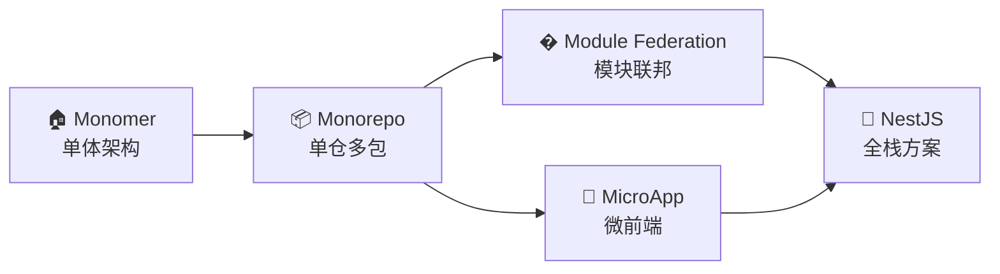
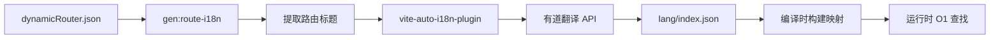

<div align="center">
  <a href="https://robotadmin.cn">
    <picture>
      <source srcset="https://cheny-chenyu.oss-cn-chengdu.aliyuncs.com/img/robot-left.png" media="(prefers-color-scheme: dark)">
      
    </picture>
  </a>

  <h1>
    
  </h1>

  <p><strong>Robot Admin - 多架构企业级解决方案</strong></p>

  <!-- 架构选择器 -->
  <table>
    <tr>
      <td align="center" width="200">
        <br>
        <sub><strong>当前分支</strong></sub><br>
        <sub>传统 SPA 架构</sub><br>
        <a href="https://github.com/ChenyCHENYU/Robot_Admin/tree/main">
          
        </a>
      </td>
      <td align="center" width="200">
        <br>
        <sub><strong>Bun Workspaces</strong></sub><br>
        <sub>多应用管理</sub><br>
        <a href="https://github.com/ChenyCHENYU/Robot_Admin/tree/monorepo">
          
        </a>
        <a href="https://github.com/ChenyCHENYU/Robot_Admin/blob/monorepo/README.md">
          
        </a>
      </td>
      <td align="center" width="200">
        <br>
        <sub><strong>Module Federation</strong></sub><br>
        <sub>初版完成</sub><br>
        <a href="https://github.com/ChenyCHENYU/Robot_Admin/tree/module-federation">
          
        </a>
        <a href="https://github.com/ChenyCHENYU/Robot_Admin/blob/module-federation/README.md">
          
        </a>
      </td>
      <td align="center" width="200">
        <br>
        <sub><strong>MicroApp</strong></sub><br>
        <sub>初版完成</sub><br>
        <a href="https://github.com/ChenyCHENYU/Robot_Admin/tree/micro-app">
          
        </a>
        <a href="https://github.com/ChenyCHENYU/Robot_Admin/blob/micro-app/README.md">
          
        </a>
      </td>
    </tr>
  </table>

  <p>
    
    
    
    
    <a href="https://vercel.com"></a>
    <a href="https://standardjs.com"></a>
  </p>
  <p>
    
    
    
    
    
  </p>
  <p>
    
    
    
  </p>

  <!-- 快速导航 -->
  <p>
    <a href="https://robotadmin.cn">
      
    </a>
    <a href="https://www.tzagileteam.com">
      
    </a>
    <a href="#-快速开始真的很快">
      
    </a>
    <a href="./CONTRIBUTING.md">
      
    </a>
    <a href="./README_EN.md">
      
    </a>
  </p>
</div>

---

<div align="center">
  <p>
    <strong>中文</strong> | <a href="./README_EN.md">English</a>
  </p>
</div>

## 🎯 多架构支持

> 💡 Robot Admin 提供多种架构分支，支持从单体到微前端的渐进演进。当前所在为**单体 SPA 开发主线**（`dev`/`main`）。

<details>
<summary><b>👉 查看各架构对比一览</b></summary>

| 架构类型          | 适用场景             | 特点                             | 分支                                                                                     | 文档                                                                                    |
| ----------------- | -------------------- | -------------------------------- | ---------------------------------------------------------------------------------------- | --------------------------------------------------------------------------------------- |
| **🏗️ 单体架构** ← | 中小型项目、快速原型 | 简单直接、开箱即用               | [`main`](https://github.com/ChenyCHENYU/Robot_Admin/tree/main)                           | 本文档                                                                                  |
| **📦 Monorepo**   | 多应用统一管理       | 代码复用、统一工具链、独立部署   | [`monorepo`](https://github.com/ChenyCHENYU/Robot_Admin/tree/monorepo)                   | [完整指南](https://github.com/ChenyCHENYU/Robot_Admin/blob/monorepo/README.md)          |
| **🔮 模块联邦**   | 微应用动态加载       | 运行时共享、独立部署、版本隔离   | [`module-federation`](https://github.com/ChenyCHENYU/Robot_Admin/tree/module-federation) | [使用指南](https://github.com/ChenyCHENYU/Robot_Admin/blob/module-federation/README.md) |
| **🚀 微前端**     | 大型应用、团队协作   | 技术栈无关、独立部署、渐进式迁移 | [`micro-app`](https://github.com/ChenyCHENYU/Robot_Admin/tree/micro-app)                 | [查看文档](https://github.com/ChenyCHENYU/Robot_Admin/blob/micro-app/README.md)         |

</details>

---

## 🚀 重新定义企业级中后台开发体验

> **🎯 一个敏捷的，为开发者体验而生的企业级中后台解决方案**

_在这里，当 `Bun` 的极致性能遇上 `Vue3` 的组合式 API，当 `TypeScript` 的类型安全拥抱 `UnoCSS` 的原子化样式..._

---

## ⚡ 为什么选择 Robot Admin？

### 🔥 按需加载与可验证的开发体验

- **按需加载** - Vite 8 路由分包，组件库使用子路径入口，首屏体积由构建预算检查
- **智能类型提示** - TypeScript 5.8 与组件库公开类型共同约束使用侧
- **Bun 统一工具链** - 安装依赖后运行 `bun run dev`，验证使用 `bun run verify`

### 🎨 不只是一个管理系统，更是一个作品

- **64 个演示页面** - 覆盖组件接入与交互场景，另有 38 条免登录预览路由；演示数据不等于生产后端
- **独立指令包** - 防抖、节流、长按、拖拽、权限等能力由 `@robot-admin/directives` 提供
- **主题系统** - 深色/浅色模式/跟随系统 + 支持自定义扩展
- **Preview 路由系统** - 38 个无鉴权独立预览路由，供 [文档站](https://www.tzagileteam.com) 通过 iframe 嵌入实时组件演示

### 🛠️ 企业级架构，个人项目也能享受

- **RBAC 权限体系** - 菜单级、按钮级、接口级，权限控制细致入微
- **渐进式微前端** - 架构设计支持从单体到微前端的平滑演进
- **生产级工程化** - ESLint + Prettier + Husky，代码质量无忧

---

## 🚀 快速开始（真的很快！）

> 🎉 本项目统一使用 **Bun**，请勿混用 npm、yarn 或 pnpm，以免锁文件和依赖树不一致。

```bash
# 1. 克隆项目
git clone https://github.com/ChenyCHENYU/Robot_Admin.git

# 2. 进入目录
cd Robot_Admin

# 3. 安装依赖
bun install

# 4. 启动项目
bun run dev
```

开发服务器的启动和热更新耗时取决于机器、缓存及启用的本地包模式；性能回归以构建预算和实际测量为准。

<details>
<summary><b>📦 更多命令</b></summary>

```bash
# 开发相关
bun run dev            # 开发环境启动
bun run dev:banner     # 显式启用完整 Git 分支横幅（会增加启动等待）
bun run dev:components # 直连本地 naive-ui-components 源码联调
bun run dev:table      # 直连本地 MachTable、组件库与 request-core 源码
bun run dev:local      # 直连本地全部包、组件库与 MachTable 源码
bun run build          # 生产环境构建
bun run build:test     # 测试环境构建
bun run build:staging  # 预发布构建
bun run preview        # 本地预览构建结果

# 代码质量
bun run lint           # 代码检查和修复
bun run lint:check     # 只检查，不修改文件
bun run format         # 代码格式化
bun run test           # 单元测试
bun run verify         # 双 Lint + 类型 + 单测 + 双模式构建 + 体积预算
bun run test:e2e       # 基于正式产物的浏览器回归（首次需安装 Chromium）
bun run check:bundle   # 校验最近一次生产构建的首屏体积预算
bun run security:audit # 检查依赖安全公告

# 类型检查
bun run type-watch     # 监听模式类型检查
bun run type-build     # 完整类型检查；本地联调时优先校验本地包公开类型
bun run type-build:installed # 仅按已安装 npm 版本复核发布态契约

# 其他
bun run commit         # 规范化提交（git cz）
bun run deploy         # Bash 分支同步脚本；不升版本、不打标签
```

本地联调命令使用 Vite 精确 alias 直连各仓库源码及其子入口，并为 npm、组件库、
MachTable 与全量联调使用隔离缓存，不修改
`package.json` 或 `bun.lock`。正式发版后应更新真实 npm 版本并使用普通
`bun run dev` / `bun run build` 验证；生产构建检测到本地 alias 标志会直接终止，
防止本地路径进入发布产物。

TypeScript 与 Vite 使用同一套本地包边界：Vite 直连源码以获得 HMR，类型检查读取对应仓库最新的 `dist/*.d.ts`，不会再误用 `node_modules` 中的旧声明。只有本地包公开 API 发生变化时才需要先在包仓库执行 build；样式和内部实现联调无需清理 Vite 缓存。正式发布并升级依赖后，使用 `bun run type-build:installed` 再做一次纯 npm 契约复核。

</details>

---

### 🔐 认证 Mock 与后端切换

项目在开发、测试环境默认使用闭环 Mock 认证和业务数据，登录、令牌刷新和用户信息的响应结构与远端接口保持一致。任意非空用户名和密码均可登录；Mock 令牌为随机不透明字符串，不包含明文凭据。在线演示构建通过 `VITE_DEPLOYMENT_PROFILE=demo` 显式启用同一套 Mock，真实业务构建必须使用 `application` 配置和远端接口。

接入后端时设置 `VITE_DEPLOYMENT_PROFILE=application`、`VITE_AUTH_MODE=remote`、`VITE_DATA_MODE=remote`，并通过 `VITE_API_BASE` 指定接口地址，无需修改页面和状态管理代码。`application` 的生产与预发构建会拒绝 Mock 模式；只有明确标记为 `demo` 的公开演示构建允许 Mock。认证契约位于 `src/api/auth.contract.ts`，账号和权限治理等远端接口约定位于 `src/api/`；完整环境及接口说明见 [`docs/production-readiness.md`](docs/production-readiness.md)。

---

## ✨ 核心亮点

### 🏗️ 技术栈（高富帅阵容）

<details>
<summary><b>查看完整技术栈</b></summary>

**🎭 前端核心**

- **Vue 3.5.42** - 🔥 Composition API 丝滑体验
- **TypeScript 5.8** - 🛡️ 类型安全，智能提示
- **Pinia 4.0.3** - 🍍 类型安全的模块化状态管理
- **Vue Router 5.3.1** - 🧭 路由守卫与动态路由
- **VueUse 14.4.0** - 🧰 按需使用的组合式工具集
- **Naive UI 2.45.3** - 🎨 颜值与性能并存的组件库
- **@robot-admin/naive-ui-components** - 🧩 51+ 业务组件库，按需自动导入
- **MachTable 0.29.2** - 🧮 独立虚拟化数据网格，通过 Vue 适配层按路由接入；演示页通过统一的 `C_ActionBar` 和数据驱动配置面板完整展示水印、密度、选择、剪贴板、分页、汇总与状态栏等能力
- **UnoCSS 66.9.1** - ⚡ 原子化CSS，按需生成，体积极小

**⚙️ 构建工具**

- **Bun 1.4.2** - 🚀 高性能 JavaScript 运行时与包管理器
- **Vite 8.2.2** - ⚡ Rolldown 构建与路由级按需加载
- **Sass 1.103** - 🎨 成熟的CSS预处理器

**🔧 开发工具**

- **ESLint 10.9** - 📏 代码质量守护者
- **Prettier 3.9** - ✨ 代码格式化
- **Oxlint 1.52** - 🦀 Rust编写的超快Linter
- **Bun Test 1.4** - 🧪 与包管理器统一的测试运行时

**📊 功能组件（via @robot-admin/naive-ui-components）**

- **ECharts 6.1** - 企业级图表库
- **AntV X6** - 专业流程图引擎（BPMN/ER/UML）
- **FullCalendar** - 完整的日程管理
- **WangEditor** - 富文本编辑器
- **XGPlayer** - 视频播放器（HLS/防作弊）
- **Vue Flow** - 工作流编辑器

</details>

### 🎯 功能矩阵

#### 🔐 权限管理

- **RBAC权限体系** - 用户-角色-权限，灵活分配
- **动态路由** - 根据权限实时生成菜单
- **按钮级权限** - 精确到每一个操作按钮
- **接口级权限** - API调用权限控制

#### 🧩 组件库（51+ 开箱即用）

> 所有业务组件已独立发布为 [`@robot-admin/naive-ui-components`](https://www.npmjs.com/package/@robot-admin/naive-ui-components)，支持按需自动导入。

<details>
<summary><b>查看所有组件</b></summary>

**核心组件**

- `C_Form` - 动态表单引擎，支持8种布局
- `C_Table` - 超级表格，支持虚拟滚动、打印水印、列设置
- `C_FormSearch` - 高级搜索表单组件
- `C_ActionBar` - 操作按钮组组件，统一按钮布局
- `C_Icon` - Iconify 运行时图标管理系统
- `C_Theme` - 主题切换组件
- `C_Language` - 国际化语言切换

**业务组件**

- `C_Code` - 代码编辑器组件
- `C_Markdown` - Markdown编辑器
- `C_Editor` - WangEditor 富文本编辑器
- `C_FormulaEditor` - 公式编辑器
- `C_Time` - 时间处理组件
- `C_Date` - 日期选择组件
- `C_Progress` - 进度展示组件
- `C_Upload` - 文件上传组件
- `C_Cron` - Cron 表达式编辑器
- `C_Steps` - 步骤条组件

**可视化 & 图表**

- `C_AntV` - AntV X6 流程图引擎（BPMN/ER/UML）
- `C_WorkFlow` - Vue Flow 工作流编辑器
- `C_VtableGantt` - 甘特图组件
- `C_FullCalendar` - 完整日程管理

**媒体 & 文件**

- `C_VideoPlayer` - XGPlayer 视频播放器（HLS/防作弊）
- `C_FilePreview` - 文件预览（PDF/Excel/Word/图片）
- `C_ImageCropper` - 图片裁剪
- `C_Signature` - 电子签名
- `C_QRCode` - 二维码生成
- `C_Barcode` - 条形码生成
- `C_AudioPlayer` - 音频播放器，播放列表、多循环模式

**交互 & 布局**

- `C_Draggable` - 拖拽排序
- `C_SplitPane` - 分割面板
- `C_CollapsePanel` - 折叠面板
- `C_WaterFall` - 瀑布流布局
- `C_Cascade` - 地区级联选择
- `C_City` - 城市选择器
- `C_Map` - Leaflet / 高德地图（强类型坐标、标记适配、安全代理）
- `C_Captcha` - 验证码
- `C_Guide` - 新手引导
- `C_GlobalSearch` - 全局搜索
- `C_NotificationCenter` - 通知中心
- `C_Chat` - 聊天组件，消息泡泡、会话列表
- `C_Timeline` - 时间线，垂直/水平多布局
- `C_ContextMenu` - 右键上下文菜单
- `C_Transfer` - 穿梭框，跨列表数据迁移
- `C_AvatarGroup` - 叠加头像组，状态徽标

</details>

#### 🎮 自定义指令

`v-copy` 复制 | `v-debounce` 防抖 | `v-throttle` 节流 | `v-permission` 权限 | `v-watermark` 水印 | `v-draggable` 拖拽 | `v-longpress` 长按

### 🎪 演示页面（64 个示例）

<details>
<summary><b>查看所有演示页面</b></summary>

**🎨 基础组件展示**

- 图标组件 - 完整的图标系统使用指南
- 地区联动 - 省市区三级联动实现
- 进度条 - 多种样式进度展示
- 时间组件 - 时间选择和格式化
- 日期选择 - 日期范围选择器
- 城市选择 - 城市选择器组件

**📝 表单与表格**

- 表单布局 - 8种表单布局模式
- 表单搜索 - 高级搜索功能
- 超级表格 - 表格的各种高级用法

**✏️ 编辑器展示**

- 日历组件 - FullCalendar完整功能
- 代码编辑器 - 多语言语法高亮
- Markdown编辑器 - 实时预览编辑
- 富文本编辑 - WangEditor完整功能

**🛠️ 实用功能**

- 导出ZIP - 批量文件打包下载
- 复制功能 - 文本复制到剪贴板
- 批量下载 - 文件批量下载处理
- 拖拽排序 - 列表项拖拽排序
- 3D展示 - Spline 3D场景
- 动画系统 - 流畅的页面转场
- 用户引导 - 新手引导系统

**💬 示范组件**

- 聊天 - 即时聊天 UI，消息泡泡与会话列表
- 时间线 - 时间轴事件展示，垂直/水平布局
- 右键菜单 - 自定义上下文菜单
- 穿梭框 - 跨列表数据迁移
- 头像组 - 叠加头像展示，状态徽标
- 音频播放器 - 播放列表、进度控制、多循环模式

</details>

---

## 🏗️ 项目架构

### 📁 目录结构

<details>
<summary><b>查看完整目录结构</b></summary>

```
Robot_Admin/
├── 📁 src/                          # 源代码目录
│   ├── 📁 api/                      # 接口管理层
│   ├── 📁 components/               # 组件（桥接层 + 局部组件）
│   │   ├── 📁 global/               # 全局桥接组件（按需引用组件库）
│   │   └── 📁 local/                # 局部组件
│   ├── 📁 views/                    # 页面视图
│   │   ├── 📁 dashboard/            # 数据看板
│   │   ├── 📁 demo/                 # 演示页面（64 个 index.vue）
│   │   ├── 📁 preview/              # 组件预览页面（38 个 iframe 嵌入路由）
│   │   ├── 📁 sys-manage/           # 系统管理
│   │   ├── 📁 login/                # 登录注册
│   │   └── 📁 home/                 # 项目主页
│   ├── 📁 stores/                   # Pinia状态管理
│   ├── 📁 composables/              # 组合式API
│   ├── 📁 hooks/                    # 自定义Hooks
│   ├── 📁 router/                   # 路由配置
│   ├── 📁 utils/                    # 工具函数
│   ├── 📁 types/                    # TypeScript类型定义
│   ├── 📁 config/                   # 环境、主题与构建配置
│   ├── 📁 assets/                   # 静态资源
│   └── 📁 plugins/                  # 插件配置
├── 📁 scripts/                      # 构建脚本
├── 📁 public/                       # 静态资源
├── ⚙️ vite.config.ts                # Vite配置
├── 🎨 unocss.config.ts              # UnoCSS配置
├── 📦 package.json                  # 项目配置
└── 🔧 tsconfig.json                 # TypeScript配置
```

</details>

### 🔄 架构演进路线


```mermaid
graph LR
    A[🏠 Monomer<br/>单体架构] --> B[📦 Monorepo<br/>单仓多包]
    B --> C[� Module Federation<br/>模块联邦]
    B --> D[🔗 MicroApp<br/>微前端]
    C --> E[🚀 NestJS<br/>全栈方案]
    D --> E
```

---

## 🛠️ 开发者工具

### VS Code 插件推荐

<details>
<summary><b>查看完整插件列表和使用说明</b></summary>

#### 必装插件

- **Vue - Official** - Vue 3 官方支持
- **TypeScript Vue Plugin** - TypeScript 支持
- **UnoCSS** - 原子化CSS智能提示
- **Naive UI Snippets** - Naive UI 代码片段

#### 实用插件详解

**1. Vscode Samge Translate 插件**

- `desc：` 用于快速中英文翻译切换，并生成变量命名方式
- `use：` Ctrl+Shift+P， 选择 Samge 进行对应功能使用
- `key：` `Alt+x` 翻译成中文， `Alt+z` 翻译成英文

**2. any-rule 插件**

- `desc：` 用于快速生成正则
- `use：` 右键 => 正则大全
- `key：` `@zz` 弹出正则选项,根据生成的选项,可以图解正则

**3. Better Comments 插件**

- `desc：` 在js文件中,通过颜色标记区分注释评论描述
- `use：` //\* 绿色 //! 红色 //? 蓝色

**4. code settings sync 插件**

- `desc：` 用于快速团队同步 vscode 插件及配置
- `use：` [使用文档](https://marketplace.visualstudio.com/items?itemName=Alex-Chen.gitee-code-settings-sync)

**5. Code Spell Checker 插件**

- `desc：` 用于快速检查代码和文档拼写是否正确
- `use：` 将非语法错误的单词添加到 cspell.json
- `key：` 拼写后单词上方提示的黄色小灯泡💡

**6. CodeSnap 插件**

- `desc：` 用于快速生成代码截图
- `use：` 右键 => 底部选项 CodeSnap

**7. EmoJi 插件**

- `desc：` 用于快速选择表情符号
- `use：` 输入 `Ctrl+Shift+P` => 输入 `emo`
- `key：` `F1 => emo`

**8. JSON to JS 插件**

- `desc：` 用于快速将json格式转换为js格式
- `use：` 从剪切板，选择转换，可选引号 3种 方式进行转换
- `key：` `Shift + Ctrl + Alt + V | S` 或 `F1 => Clipboard`

**9. koroFileHeader 插件**

- `desc：` 用于添加头部注释，函数注释
- `use：` 在文件头部使用快捷键，或自动识别生成
- `key：` `ctrl+win+i` 头部注释 `ctrl+win+t` 函数注释

**10. TODO Tree 插件**

- `desc：` 用于快速高亮代码中的 TODO 等标记性注释
- `use：` 通过注释关键词的方式，高亮显示
- `key：` TODO: 待完成 | BUG: 问题 | FIXME: 待修复 | HACK: 自定义

**11. Turbo Console Log 插件**

- `desc：` 用于快速生成 console 打印信息
- `use：` 通过选中变量，按下快捷键，生成打印句柄
- `key：` `ctrl+alt+l` 生成 `alt+shift+c` 注释所有 **+u** 启用所有 **+d** 删除所有

</details>

---

## 🌍 国际化 (i18n)

### 自动化路由翻译

项目集成了 **vite-auto-i18n-plugin**，支持路由标题的自动翻译。

<details>
<summary><b>查看详细使用说明</b></summary>

#### 快速使用

```bash
# 1. 在 dynamicRouter.json 中添加新菜单（只需要中文）
{
  "meta": {
    "title": "新功能模块"
  }
}

# 2. 运行自动生成脚本
bun run gen:route-i18n

# 3. 重启开发服务器（首次需要）
bun run dev
```

**就这么简单！** 插件会自动调用有道翻译 API 将中文翻译成英文。

#### 工作原理


```mermaid
graph LR
    A[dynamicRouter.json] --> B[gen:route-i18n]
    B --> C[提取路由标题]
    C --> D[vite-auto-i18n-plugin]
    D --> E[有道翻译 API]
    E --> F[lang/index.json]
    F --> G[编译时构建映射]
    G --> H[运行时 O1 查找]
```

#### 特性

- ✅ **零配置** - 添加中文标题后运行一条命令即可
- ✅ **自动翻译** - 调用有道翻译 API 自动生成英文
- ✅ **高性能** - O(1) 查找，编译时构建映射表
- ✅ **零维护** - HMR 自动更新，无需手动管理翻译

#### 详细文档

#### 详细文档

📖 完整使用指南：[国际化实践指南 - 在线文档](https://www.tzagileteam.com/robot/guide/i18n-practice)

</details>

</details>

---

## 📊 性能与构建预算

<details>
<summary><b>查看可复现的性能门禁</b></summary>

运行 `bun run build && bun run check:bundle` 可复核入口、预加载、样式、首屏合计及最大异步块预算。2026-10-01 的演示生产构建结果为：入口 306.60 KiB、预加载 488.85 KiB / 64 个、样式 290.60 KiB、首屏合计 1086.04 KiB，均通过预算。这里统计的是构建资源体积，不代表真实网络传输量或页面加载耗时；最新数字以命令输出为准。

### 构建优化

- **Tree Shaking** - 无用代码自动移除
- **代码分割** - 按需加载，减少首屏时间
- **体积预算** - 构建后自动检查首屏资源和最大异步块

### 运行时优化

- **组件懒加载** - 路由级别懒加载
- **可选预取** - 登录后按网络和设备条件渐进预取重量级页面

</details>

---

## 💬 社区互动

> 🚧 **本项目仍在快速迭代，欢迎任何使用反馈、功能建议、甚至吐槽！没有蠢问题，只有没被发现的优化点。**

### 🎯 你的反馈，让项目变得更好

我明确想知道这些，请直接告诉我：

| 反馈类型        | 你可以告诉我                         | 入口                                                                |
| --------------- | ------------------------------------ | ------------------------------------------------------------------- |
| 🏢 **使用场景** | 你在做什么项目？解决了什么业务问题？ | [提 Issue →](https://github.com/ChenyCHENYU/Robot_Admin/issues/new) |
| 🧩 **组件体验** | 哪些组件用着顺手？哪些还需要打磨？   | [提 Issue →](https://github.com/ChenyCHENYU/Robot_Admin/issues/new) |
| 🚀 **上手体验** | 文档哪里说不清楚？部署遇到了什么坑？ | [提 Issue →](https://github.com/ChenyCHENYU/Robot_Admin/issues/new) |
| 💡 **业务需求** | 你需要但还没有的组件或功能是什么？   | [提 Issue →](https://github.com/ChenyCHENYU/Robot_Admin/issues/new) |

---

## 🤝 参与贡献

> **来啊，快活啊！一起搞事情啊！** 🎉

<details>
<summary><b>查看贡献指南</b></summary>

### 🚀 30秒快速上手贡献

```bash
# 1. Fork + Clone
git clone https://github.com/你的用户名/Robot_Admin.git

# 2. 安装依赖
bun install

# 3. 创建分支
git checkout -b feat/awesome-feature

# 4. 提交修改
bun run verify
git commit -m "feat: 新功能"

# 5. 提交PR
```

### 💡 贡献方向

**🎨 UI/演示页面贡献**

- 在 `src/views/demo/` 下新建页面
- 展示一个完整的业务场景
- 代码要有注释，能复制粘贴直接用

**🧩 组件开发贡献**

- 通用业务组件优先在独立的 `@robot-admin/naive-ui-components` 仓库维护
- 应用内的 `src/components/global/` 仅保留宿主桥接组件，避免复制组件库实现
- 新组件须声明 `name` 并提供 TypeScript 类型

**🛠️ 工具函数贡献**

- `src/utils/` 目录下
- 要有单元测试
- 要有 JSDoc 注释

查看 [贡献指南](./CONTRIBUTING.md) 了解更多。

</details>

---

## 🚀 部署方案

### ☁️ 多环境支持

<details>
<summary><b>查看部署详情</b></summary>

**环境配置**

- **开发环境** - 本地开发调试
- **测试环境** - 功能测试验证
- **预发布环境** - 生产前最后验证
- **生产环境** - 线上正式环境

**当前仓库提供的构建与部署配置**

```bash
bun run build             # envs/.env.production：公开演示产物 dist/
bun run build:application # envs/.env.staging：真实业务预发验收产物 dist/application/
```

仓库内的 `vercel.json` 提供静态站点路由回退与安全响应头。部署到其他平台时需要等效配置；真实业务部署还必须按 [`envs/README.md`](envs/README.md) 接入远端认证、业务 API 和同源代理，不能直接把公开演示配置用于生产。当前仓库没有 Dockerfile 或 GitHub Pages 工作流。

</details>

---

## 📈 路线图

### ✅ 已完成里程碑

<details>
<summary><b>查看完整版本历程 (v1.0 → v2.6.2)</b></summary>

| 版本   | 时间    | 主要更新                                             |
| ------ | ------- | ---------------------------------------------------- |
| v1.0   | 2025-07 | 🎉 项目初版：Vue3 + Vite + Naive UI + Pinia 基础架构 |
| v1.6   | 2025-10 | 🎨 主题系统 + UnoCSS + 演示页面体系                  |
| v1.11  | 2025-12 | 🧩 组件库雏形 + i18n 国际化 + 性能优化               |
| v1.12  | 2026-02 | 📦 `@robot-admin/request-core` 独立发布              |
| v1.13  | 2026-02 | 🔧 Composable 架构重构，各 npm 包逐步独立发布        |
| v1.14  | 2026-02 | ✨ 新增 10 个组件（签名/裁剪/Cron/瀑布流等）         |
| v2.0   | 2026-03 | 🏗️ **架构重构**：39 个组件迁移至独立 npm 包，零冗余  |
| v2.1   | 2026-03 | 🔐 Token 无感刷新 + 权限体系升级 + 可插拔登录组件    |
| v2.2   | 2026-03 | 🎭 菜单双主题 + Vite 8 升级 + 全量 TypeScript 通过   |
| v2.2.1 | 2026-03 | 🔧 Vite 8.0.3 正式升级 + 样式细节优化                |
| v2.3   | 2026-04 | 🤖 AI 技能、MCP Server 与工程协作规范                |
| v2.4   | 2026-04 | 🎨 设计风格系统与 iOS 拟态玻璃主题                   |
| v2.5   | 2026-08 | ⚡ 路由级按需加载与菜单分组                          |
| v2.6   | 2026-10 | 🛡️ 生产就绪加固、组件接入治理与演示页回归门禁        |
| v2.6.1 | 2026-10 | 📝 中英文文档、贡献与生产接入说明同步当前实现        |
| v2.6.2 | 2026-10 | 🤖 修复生产 CSP 阻断登录页 3D 机器人                 |

</details>

### 🚀 下一阶段

- [ ] 📈 Web Vitals 真实用户性能监控与可观测平台接入
- [ ] 🎨 可视化低代码页面模板
- [ ] 🏢 多租户系统支持

### 🌟 长期规划

- [ ] 🏗️ Robot Nest — NestJS 全栈服务
- [ ] 🔄 完整的 CI/CD 流水线集成示例
- [ ] 🌐 完整 i18n 国际化方案（更多语言）

---

## 🌟 生态系统

### 🔗 相关项目

<details>
<summary><b>查看生态项目</b></summary>

**已发布组件库**

- **[@robot-admin/naive-ui-components](https://www.npmjs.com/package/@robot-admin/naive-ui-components)** `v0.13.0` - 基于 Naive UI 的 Vue 3 业务组件库（53 个组件，按需导入）
- **[@robot-admin/layout](https://www.npmjs.com/package/@robot-admin/layout)** `v3.2.1` - 6 种布局模式 + `/naive` 单入口 + Vue Headless 分层
- **[@robot-admin/request-core](https://www.npmjs.com/package/@robot-admin/request-core)** `v0.6.1` - 实例化 Axios 编排、认证恢复与函数式 Headless CRUD
- **[@robot-admin/form-validate](https://www.npmjs.com/package/@robot-admin/form-validate)** `v3.4.2` - Naive UI / Element Plus 双框架企业级表单验证规则库
- **[@robot-admin/directives](https://www.npmjs.com/package/@robot-admin/directives)** `v2.0.1` - 11 个安全、可回收的 Vue 指令
- **[@robot-admin/file-utils](https://www.npmjs.com/package/@robot-admin/file-utils)** `v3.0.1` - Excel/ZIP/RFC 4180 CSV/可取消分片工具集
- **[@robot-admin/theme](https://www.npmjs.com/package/@robot-admin/theme)** `v0.6.1` - 分层主题核心、Vue 状态管理与 Naive UI 适配
- **[@robot-admin/git-standards](https://www.npmjs.com/package/@robot-admin/git-standards)** `v1.0.5` - 安全初始化、配置保护与双模块兼容的 Git 工程化标准

**已发布周边工具**

- **[Robot CLI](https://github.com/ChenyCHENYU/robot-cli)** ✅ - 脚手架工具，快速初始化项目模板
- **[Robot uniApp](https://github.com/ChenyCHENYU/robot-uniapp)** ✅ - 移动端跨平台解决方案（已完成）
- **[Robot Nest](https://github.com/ChenyCHENYU/robot-nest)** 🚧 - NestJS 全栈后端服务（规划中）

**已发布 npm 插件**

- **[vite-console-plugin](https://www.npmjs.com/package/vite-console-plugin)** `v2.0.15` - Vite 启动台控制台美化与提示插件
- **[ts-type-cleaner](https://www.npmjs.com/package/ts-type-cleaner)** `v5.0.8` - 智能 TypeScript 类型分析和清理工具
- **[vite-plugin-preloader](https://www.npmjs.com/package/vite-plugin-preloader)** `v2.0.1` - 独立路由预加载工具（Robot Admin 当前使用 Vite 原生 warmup + 运行时意图预取，未接入此插件）
- **[git-branch-check-diff-commits](https://www.npmjs.com/package/git-branch-check-diff-commits)** `v1.2.2` - Git 分支快速比对合并检查
- **[git-log-formatter](https://www.npmjs.com/package/git-log-formatter)** `v1.0.2` - Git log 格式化美化工具
- **[standards-cli](https://www.npmjs.com/package/standards-cli)** `v1.0.13` - 前端工程化提交规范初始化工具
- **[mgit-push](https://www.npmjs.com/package/mgit-push)** `v1.0.5` - 同时推送到多个 Git 平台
- **[@agile-team/robot-cli](https://www.npmjs.com/package/@agile-team/robot-cli)** `v1.1.12` - 现代化项目脚手架工具
- **[@agile-team/naive-ui-components](https://www.npmjs.com/package/@agile-team/naive-ui-components)** `v0.1.4` - Naive UI 组件库（旧版，已迁移至 @robot-admin）
- **[@agile-team/vscode-config](https://www.npmjs.com/package/@agile-team/vscode-config)** `v2.0.8` - 团随 VSCode 配置一键安装工具

</details>

---

## 🖼️ 项目预览

<table width="100%">
<tr>
<td width="50%" align="center">


<br><strong>登录页面</strong>

</td>
<td width="50%" align="center">


<br><strong>首页页面</strong>

</td>
</tr>
</table>

> **🎯 [在线预览](https://www.robotadmin.cn/)** | **📖 [项目文档](https://www.tzagileteam.com)**
>
> 注意：若无法访问请关闭科学上网，或访问 [备用地址](https://robot-admin-new.vercel.app/)

---

## 🖥️ 浏览器支持

**现代浏览器，拒绝IE**

| [](http://godban.github.io/browsers-support-badges/)<br/>Edge | [](http://godban.github.io/browsers-support-badges/)<br/>Firefox | [](http://godban.github.io/browsers-support-badges/)<br/>Chrome | [](http://godban.github.io/browsers-support-badges/)<br/>Safari |
| ----------------------------------------------------------------------------------------------------------------------------------------------------------------------------------------------------- | ----------------------------------------------------------------------------------------------------------------------------------------------------------------------------------------------------------------- | ------------------------------------------------------------------------------------------------------------------------------------------------------------------------------------------------------------- | ------------------------------------------------------------------------------------------------------------------------------------------------------------------------------------------------------------- |
| last 2 versions                                                                                                                                                                                       | last 2 versions                                                                                                                                                                                                   | last 2 versions                                                                                                                                                                                               | last 2 versions                                                                                                                                                                                               |

---

## 💻 系统要求

<details>
<summary><b>查看详细要求</b></summary>

### 🔧 开发环境

- **Node.js**: >= 22.18 (推荐最新 LTS)
- **Bun**: >= 1.4.2（以 `package.json` 的 `engines` 为准）
- **内存**: >= 8GB RAM
- **存储**: >= 1GB 可用空间
- **系统**: Windows 10+, macOS 12+, Ubuntu 20.04+

### ⚙️ 可选工具

- **VS Code**: 推荐编辑器
- **Git**: >= 2.20.0
- **Docker**: >= 20.0 (容器部署)

</details>

---

## 🛠️ 故障排除

<details>
<summary><b>常见问题解决</b></summary>

### ❌ Bun 安装失败

```bash
# Windows 用户
curl -fsSL https://bun.sh/install | bash

# macOS 用户
brew install oven-sh/bun/bun

# PowerShell 用户也可使用 Bun 官方安装脚本
powershell -c "irm bun.sh/install.ps1 | iex"
```

### ⚠️ 端口占用问题

```bash
# 在已被 Git 忽略的 envs/.env.local 中设置
VITE_PORT=1989
```

### 🔧 TypeScript 类型错误

```bash
# 检查应用及配置类型
bun run type-build

# 只按正式安装包复核跨包类型
bun run type-build:installed
```

### 📦 构建失败

```bash
# 保留仓库的 bun.lock，按锁文件恢复依赖
bun install --frozen-lockfile

# 运行完整本地门禁
bun run verify
```

</details>

---

## 🔒 安全与权限

### 🛡️ 多层次权限控制

- **页面级权限** - 路由访问控制
- **菜单级权限** - 导航菜单显示控制
- **按钮级权限** - 操作按钮权限控制
- **接口级权限** - API调用权限验证

### 🔐 身份认证

- `JWT Token` 认证
- 刷新Token自动续期
- 多终端登录管理
- 密码强度验证

---

## 🎯 项目定位

- 单体 SPA 主线提供权限、主题、路由和 Remote/Mock 数据边界；其他架构保留在独立分支。
- 业务组件与 11 个指令由独立包维护，应用通过深层入口按需消费；`src/views/demo/` 提供 64 个使用示例。
- `bun run verify` 与 `bun run test:e2e` 提供可复现的静态、构建和浏览器门禁；真实业务仍需接入后端并执行集成验收。

---

## ❓ 你可能会有的一些小疑问

<details>
<summary><b>FAQ</b></summary>

**🔧 为什么统一使用 Bun？**

- 项目锁文件、脚本和测试均以 Bun 为准；混用包管理器可能产生不同依赖树。

**🎨 如何自定义主题？**

1. 在 `src/config/theme/tokens.ts` 调整应用主题 Token，在 `naive-overrides.ts` 调整 Naive UI 覆盖
2. 使用 `C_Theme` 切换浅色、深色或跟随系统；接入边界见 [主题架构文档](docs/design-system/THEME-ARCHITECTURE.md)

**🔐 权限系统如何使用？**

- 页面级：路由守卫控制
- 菜单级：动态菜单生成
- 按钮级：v-permission指令
- 接口级：后端必须自行校验权限；前端请求层不能替代服务端鉴权

**📱 是否支持移动端？**

- 提供响应式布局；接入具体业务页面后仍需在目标设备和浏览器上验证交互

**🔄 如何从其他项目迁移？**

- 优先参考组件库公开类型与本仓库的 64 个演示页，按页面逐步接入并运行验证

</details>

---

## 📞 联系我们

**🧑‍💻 作者信息**

- **姓名：** CHENY
- **身份：** 个人开发者 · 前端架构师（开源爱好者）
- **公众号：** 前端咔啦咪（小红书同名）
- **邮箱：** [ycyplus@gmail.com](mailto:ycyplus@gmail.com)
- **GitHub：** [@ChenyCHENYU](https://github.com/ChenyCHENYU)
- **npm：** [@cheny_yang](https://www.npmjs.com/~cheny_yang)

---

### 🤝 贡献者

感谢所有为项目做出贡献的开发者：

<a href="https://github.com/ChenyCHENYU/robot-admin/graphs/contributors">
  
</a>

**期望你成为贡献者:**

- 🐛 报告 Bug | 💡 提出功能建议 | 📝 改进文档 | 🔧 提交代码 | 🌍 翻译文档 | 📢 推广项目

---

## 🏆 特别鸣谢

<details>
<summary><b>致谢名单</b></summary>

### 🌟 开源项目致谢

**核心技术**

- **Vue.js 团队** - 提供强大的框架基础
- **Naive UI 团队** - 提供优秀的组件库
- **Vite 团队** - 提供极速的构建工具
- **Bun 团队** - 提供革命性的运行时
- **Anthony Fu** - UnoCSS、unplugin等工具的创作者
- **尤雨溪 (Evan You)** - Vue.js 的创造者

**功能组件**

- **ECharts** - 数据可视化图表库
- **AntV X6** - 图编辑引擎
- **FullCalendar** - 日历组件
- **WangEditor** - 富文本编辑器

### 👨‍💻 社区支持

- **所有 Star 的开发者** - 给予项目信心和动力
- **提出 Issue 的用户** - 帮助项目发现和改进问题
- **贡献 PR 的开发者** - 让项目变得更好
- **使用项目的企业** - 验证项目的实用价值

> _"一个人可以走得很快，但一群人可以走得更远。感谢每一位支持 Robot Admin 的朋友！"_

</details>

---

## 📄 更新日志

### 🛠️ v2.6.2 (2026-10-02) — 最新版本

- 精确放行 Spline 所需的 WebAssembly 编译，恢复生产登录页 3D 机器人；继续禁止普通 JavaScript `eval`

### 📝 v2.6.1 (2026-10-01)

- 同步中英文 README、贡献指南、环境与生产接入文档，移除失效的性能宣称和过期联系入口

### 🚀 v2.6.0 (2026-10-01)

- 🧩 **组件接入**：升级业务组件库至 `0.13.0`，精简表单、表格及演示页面的使用方式
- 🛡️ **生产就绪**：补齐远端数据契约、错误脱敏、安全头与登录及权限回归保护
- ⚡ **体验与性能**：优化首屏、路由预取及样式按需加载，并增加构建体积预算门禁
- 🧪 **验证能力**：增加单测和浏览器回归覆盖，收紧类型与构建检查

### 🚀 v2.5.0 (2026-08-10)

- 🧭 **布局与菜单**：新增分组菜单右侧展开面板，完善多布局导航体验
- ⚡ **按需加载**：大型页面、编辑器和文件能力改为路由级加载，降低首屏负担
- 🧩 **组件工程化**：业务组件使用子路径入口和官方 Resolver

<details>
<summary><b>📆 查看历史版本记录 (v1.0 — v2.2)</b></summary>

### 🎭 v2.2.0 (2026-03-11)

- ✨ **菜单双主题**：增加菜单主题切换，提供个性/标准两种多态模式
- 🔐 **权限体系升级**：按钮权限、路由鉴权、数据权限全面启用
- ⚡ **Token 无感刷新**：登录态不中断自动刷新 Token
- 🔧 **Vite 8 + Rolldown**：构建速度提升 10-30 倍
- 🧩 演示页面批量优化，全量 TypeScript 类型检查通过

### 🎨 v2.1.0 (2026-03-06)

- ✨ 可插拔式 `C_Login` 登录组件，支持自定义扩展
- 🔄 新增穿梭框 / 头像组 / 音频播放器组件
- 🚀 38 个无鉴权预览路由，供文档站 iframe 嵌入
- 🐛 登录页性能、错误拦截、中英文验证全面优化

### 🏗️ v2.0.0 (2026-03-02) — 破坏性升级

- 📦 **39 个组件全面迁移** 至 `@robot-admin/naive-ui-components`
- ✅ 全量 `vue-tsc` 类型检查通过
- 🔧 清理冗余依赖，简化主项目依赖树

### ✨ v1.14.0 (2026-02-27)

- 新增电子签名 / 图片裁剪 / Cron 表达式编辑器 / 分割面板 / 公式编辑器 / 瀑布流 等 10 个组件
- 将 `C_Notice` 升级为 `C_NotificationCenter` 全局通知插件

### 📦 v1.13.x (2026-02-08 — 2026-02-17)

- `@robot-admin/layout` 升级 v2.2.0，支持 View Transition API 主题切换
- `@robot-admin/*` 各包逐步独立发布到 npm
- i18n 自动翻译路由 + 分包优化

### v1.11.x (2025-11 — 2025-12)

- 组件库雏形建立、Vitest 测试框架集成
- 全局搜索组件、内置权限指令系统

### v1.0 — v1.11 (2025-07 — 2025-12)

- 项目核心框架建立、主题系统、动态表单/表格引擎、Demo 页面体系建设

</details>

> 📚 查看完整 [CHANGELOG.md](./CHANGELOG.md)

---

## 📄 开源许可

本项目基于 [MIT License](./LICENSE) 开源协议。

```
MIT License

Copyright (c) 2026 ChenY (Robot Admin)

Permission is hereby granted, free of charge, to any person obtaining a copy
of this software and associated documentation files (the "Software"), to deal
in the Software without restriction, including without limitation the rights
to use, copy, modify, merge, publish, distribute, sublicense, and/or sell
copies of the Software, and to permit persons to whom the Software is
furnished to do so, subject to the following conditions:

The above copyright notice and this permission notice shall be included in all
copies or substantial portions of the Software.
```

**这意味着您可以：**
✅ 免费使用 | ✅ 修改源代码 | ✅ 商业使用 | ✅ 私有部署 | ✅ 分发和再许可

**唯一要求：**
📄 保留版权声明和许可证

---

<div align="center">

## 🚀 加入 Robot Admin

<p>
  <strong>如果这个项目帮助到了你，请给个 ⭐ Star 支持一下！</strong><br>
  <em>你的 Star 是我们前进的动力 🌟</em>
</p>

<p>
  <a href="https://github.com/ChenyCHENYU/robot_admin">
    
  </a>
  <a href="https://github.com/ChenyCHENYU/robot_admin/fork">
    
  </a>
  <a href="https://www.robotadmin.cn">
    
  </a>
</p>

<br>

### 🎯 下一步行动

<p>
  🔥 <strong>立即使用</strong><br>
  <code>git clone https://github.com/ChenyCHENYU/robot_admin.git</code><br>
  <em>30秒启动你的项目</em>
</p>

<p>
  📚 <strong>学习文档</strong><br>
  <a href="https://www.tzagileteam.com">查看完整文档</a><br>
  <em>从入门到精通</em>
</p>

<p>
  💬 <strong>加入讨论</strong><br>
  <a href="https://github.com/ChenyCHENYU/robot-admin/discussions">GitHub讨论区</a><br>
  <em>与开发者交流</em>
</p>

<br>

### 💝 支持项目发展

<p>
  <a href="https://github.com/sponsors/ChenyCHENYU">
    
  </a>
  <a href="mailto:ycyplus@gmail.com">
    
  </a>
</p>

<br>

**🤖 Robot Admin - 让中后台开发变得简单而优雅**

<p>
  <em>"好的工具不仅要功能强大，更要让开发者用得愉快"</em><br>
  <strong>— Robot Admin 团队</strong>
</p>

<br>

<p>
  <strong>Made with ❤️ by <a href="https://github.com/ChenyCHENYU">@ChenyCHENYU</a></strong><br>
  <em>感谢开源让世界更美好 🌍</em>
</p>

</div>
