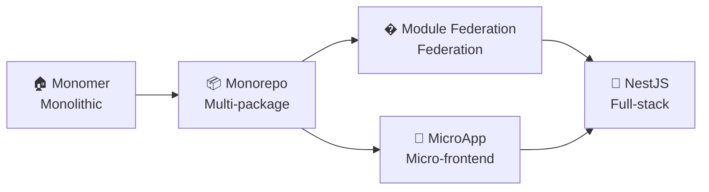

<div align="center">
  <a href="https://robotadmin.cn">
    <picture>
      <source srcset="https://cheny-chenyu.oss-cn-chengdu.aliyuncs.com/img/robot-left.png" media="(prefers-color-scheme: dark)">
      
    </picture>
  </a>
  
  <h1>
    
  </h1>
  
  <p><strong>Robot Admin - Multi-Architecture Enterprise Solution</strong></p>

  <!-- Architecture Selector -->
  <table>
    <tr>
      <td align="center" width="200">
        <br>
        <sub><strong>Current Branch</strong></sub><br>
        <sub>Traditional SPA</sub><br>
        <a href="https://github.com/ChenyCHENYU/Robot_Admin/tree/main">
          
        </a>
      </td>
      <td align="center" width="200">
        <br>
        <sub><strong>Bun Workspaces</strong></sub><br>
        <sub>Multi-App Management</sub><br>
        <a href="https://github.com/ChenyCHENYU/Robot_Admin/tree/monorepo">
          
        </a>
        <a href="https://github.com/ChenyCHENYU/Robot_Admin/blob/monorepo/README.md">
          
        </a>
      </td>
      <td align="center" width="200">
        <br>
        <sub><strong>Webpack/Vite Federation</strong></sub><br>
        <sub>Initial Release</sub><br>
        <a href="https://github.com/ChenyCHENYU/Robot_Admin/tree/module-federation">
          
        </a>
        <a href="https://github.com/ChenyCHENYU/Robot_Admin/blob/module-federation/README.md">
          
        </a>
      </td>
      <td align="center" width="200">
        <br>
        <sub><strong>MicroApp</strong></sub><br>
        <sub>Initial Release</sub><br>
        <a href="https://github.com/ChenyCHENYU/Robot_Admin/tree/micro-app">
          
        </a>
        <a href="https://github.com/ChenyCHENYU/Robot_Admin/blob/micro-app/README.md">
          
        </a>
      </td>
    </tr>
  </table>

  <p>
    <a href="https://github.com/ChenyCHENYU/robot_admin/actions"></a>
    <a href="https://standardjs.com"></a>
    
    
    
    
  </p>
  <p>
    
    
    
    
    
  </p>
  <p>
    
    
    
  </p>

  <!-- Quick Navigation -->
  <p>
    <a href="https://robotadmin.cn">
      
    </a>
    <a href="https://www.tzagileteam.com">
      
    </a>
    <a href="#-quick-start-lightning-fast">
      
    </a>
    <a href="./CONTRIBUTING.md">
      
    </a>
    <a href="./README.md">
      
    </a>
  </p>
</div>

---

<div align="center">
  <p>
    <strong>English</strong> | <a href="./README.md">中文</a>
  </p>
</div>

## 🎯 Multi-Architecture Support

> 💡 Robot Admin supports multiple architecture branches for progressive evolution from monolith to micro-frontend. You are currently on the **Single SPA development main line** (`dev`/`main`).

<details>
<summary><b>👉 View Architecture Comparison</b></summary>

| Architecture             | Use Cases                                | Features                                                           | Branch                                                                                                   | Documentation                                                                                                            |
| ------------------------ | ---------------------------------------- | ------------------------------------------------------------------ | -------------------------------------------------------------------------------------------------------- | ------------------------------------------------------------------------------------------------------------------------ |
| **🏗️ Monolithic** ←      | Small-Medium Projects, Rapid Prototyping | Simple & Direct, Out-of-Box                                        | [`main`](https://github.com/ChenyCHENYU/Robot_Admin/tree/main)                                           | This Document                                                                                                            |
| **📦 Monorepo**          | Multi-App Management                     | Code Reuse, Unified Toolchain, Independent Deployment              | [`monorepo`](https://github.com/ChenyCHENYU/Robot_Admin/tree/monorepo)                                   | [Complete Guide](https://github.com/ChenyCHENYU/Robot_Admin/blob/monorepo/docs/GUIDE.md)                                 |
| **🔮 Module Federation** | Dynamic Micro-App Loading                | Runtime Sharing, Independent Deployment, Version Isolation         | [`feature/module-federation`](https://github.com/ChenyCHENYU/Robot_Admin/tree/feature/module-federation) | [Usage Guide](https://github.com/ChenyCHENYU/Robot_Admin/blob/feature/module-federation/docs/MODULE_FEDERATION_GUIDE.md) |
| **🚀 Micro Frontend**    | Large Apps, Team Collaboration           | Tech Stack Agnostic, Independent Deployment, Progressive Migration | [`micro-app`](https://github.com/ChenyCHENYU/Robot_Admin/tree/micro-app)                                 | [View Docs](https://github.com/ChenyCHENYU/Robot_Admin/blob/micro-app/README.md)                                         |

</details>

---

## 🚀 Redefining Enterprise Admin Development Experience

> **🎯 An agile, developer-experience-first enterprise admin solution**

_Here, when `Bun's` ultimate performance meets `Vue3's` Composition API, when `TypeScript's` type safety embraces `UnoCSS's` atomic styling..._

---

## ⚡ Why Choose Robot Admin?

### 🔥 Monster-Level Performance Development Experience

- **Millisecond Hot Updates** - Bun + Vite7 chemical reaction, say goodbye to waiting
- **Intelligent Type Hints** - TypeScript5.8 + 51+ custom components, IDE intelligence maxed out
- **Zero Config Out-of-Box** - One command to start, complete admin system in 30 seconds

### 🎨 Not Just a Management System, But a Masterpiece

- **54+ Carefully Crafted Demo Pages** - Each one is production-ready business component, 51 components support docs site iframe live preview
- **7 Custom Directives** - Debounce, throttle, long press, drag, permission... Make development elegant
- **Theme System** - Dark/Light mode/Follow system + Custom extension support

### 🛠️ Enterprise Architecture, Personal Projects Can Also Enjoy

- **RBAC Permission System** - Menu-level, button-level, API-level, fine-grained permission control
- **Progressive Micro-frontend** - Architecture design supports smooth evolution from monolith to micro-frontend
- **Production-Grade Engineering** - ESLint + Prettier + Husky, code quality assured

---

## 🚀 Quick Start (Lightning Fast!)

> 🎉 **Recommended using Bun** - Experience unprecedented installation speed

```bash
# 1. Clone project
git clone https://github.com/ChenyCHENYU/robot_admin.git

# 2. Enter directory
cd robot_admin

# 3. Install dependencies (lightning fast)
bun install    # Recommended! 10x speed boost
# or use npm install / yarn install / pnpm install

# 4. Start project (millisecond startup)
bun dev
```

**🔥 First startup takes less than 2 seconds, subsequent hot updates under 100ms!**

<details>
<summary><b>📦 More Commands</b></summary>

```bash
# Development
bun dev                # Start development environment
bun run build          # Production build
bun run build:test     # Test environment build
bun run build:staging  # Staging build
bun run preview        # Preview build locally

# Code Quality
bun run lint           # Code check and fix
bun run format         # Code formatting
bun test:unit          # Unit testing

# Type Checking
bun run type-watch     # Watch mode type checking
bun run type:check     # Smart type analysis

# Others
bun run commit         # Standardized commit (git cz)
bun outdated           # Check dependency updates
bun clean              # Clean cache
```

</details>

---

## ✨ Core Highlights

### 🏗️ Tech Stack (Premium Arsenal)

<details>
<summary><b>View Complete Tech Stack</b></summary>

**🎭 Frontend Core**

- **Vue 3.5.13** - 🔥 Latest stable version, silky Composition API experience
- **TypeScript 5.8** - 🛡️ Type safety, intelligent hints
- **Naive UI 2.41.0** - 🎨 Component library with both beauty and performance
- **@robot-admin/naive-ui-components** - 🧩 51+ business components, auto-import on demand
- **UnoCSS 66.3.3** - ⚡ Atomic CSS, on-demand generation, minimal size

**⚙️ Build Tools**

- **Bun 1.x** - 🚀 Performance monster, 10x installation speed
- **Vite 7.0.0** - ⚡ Next-generation build tool, lightning hot updates
- **Sass 1.87** - 🎨 Mature CSS preprocessor

**🔧 Development Tools**

- **ESLint 9.21** - 📏 Code quality guardian
- **Prettier 3.5** - ✨ Code formatting
- **Oxlint 0.15** - 🦀 Ultra-fast Linter written in Rust
- **Vitest 3.0** - 🧪 Modern testing framework

**📊 Functional Components**

- **ECharts 5.6** - Enterprise-grade chart library
- **AntV X6** - Professional flowchart engine
- **FullCalendar** - Complete calendar management
- **WangEditor** - Rich text editor
</details>

### 🎯 Feature Matrix

#### 🔐 Permission Management

- **RBAC Permission System** - User-Role-Permission, flexible assignment
- **Dynamic Routing** - Real-time menu generation based on permissions
- **Button-Level Permissions** - Precise control down to every action button
- **API-Level Permissions** - API call permission control

#### 🧩 Component Library (51+ Ready-to-Use)

<details>
<summary><b>View All Components</b></summary>

**Core Components**

- `C_Form` - Dynamic form engine, supports 8 layouts
- `C_Table` - Super table with virtual scrolling support
- `C_FormSearch` - Advanced search form component
- `C_ActionBar` - Action button group, unified layout
- `C_Icon` - Iconify runtime icon management system
- `C_Theme` - Theme switching component
- `C_Language` - i18n language switcher
- `C_Menu` - Smart navigation menu
- `C_Breadcrumb` - Breadcrumb navigation
- `C_TagsView` - Tags view navigation
- `C_GlobalSearch` - Global search panel
- `C_Login` - Login component (5 modes / captcha / remember me)

**Business Components**

- `C_Code` - Code editor component
- `C_Markdown` - Markdown editor
- `C_Editor` - WangEditor rich text editor
- `C_FormulaEditor` - Formula editor
- `C_Time` - Time processing component
- `C_Date` - Date selection component
- `C_Progress` - Progress display component
- `C_Upload` - File upload component
- `C_Cron` - Cron expression editor
- `C_Steps` - Steps component

**Visualization & Charts**

- `C_AntV` - AntV X6 flowchart engine (BPMN/ER/UML)
- `C_WorkFlow` - Vue Flow workflow editor
- `C_VtableGantt` - Gantt chart component
- `C_FullCalendar` - Full calendar event management

**Media & Files**

- `C_VideoPlayer` - XGPlayer video player (HLS/anti-cheat)
- `C_FilePreview` - File preview (PDF/Excel/Word/Image)
- `C_ImageCropper` - Image cropper
- `C_Signature` - Electronic signature
- `C_QRCode` - QR code generator
- `C_Barcode` - Barcode generator
- `C_AudioPlayer` - Audio player with playlist & multi-loop mode

**Interactive & Layout**

- `C_Draggable` - Drag and drop sorting
- `C_SplitPane` - Split panel
- `C_CollapsePanel` - Collapse panel
- `C_WaterFall` - Waterfall layout
- `C_Cascade` - Region cascade selection
- `C_City` - City selector
- `C_Map` - Leaflet map
- `C_Captcha` - Verification code
- `C_Guide` - User guide
- `C_NotificationCenter` - Notification center
- `C_Chat` - Chat UI with message bubbles & contact list
- `C_Timeline` - Timeline events, vertical/horizontal layout
- `C_ContextMenu` - Custom right-click context menu
- `C_Transfer` - Shuttle box for cross-list data migration
- `C_AvatarGroup` - Stacked avatar group with status badges
</details>

#### 🎮 Custom Directives

`v-copy` Copy | `v-debounce` Debounce | `v-throttle` Throttle | `v-permission` Permission | `v-watermark` Watermark | `v-draggable` Draggable | `v-longpress` Long Press

### 🎪 Demo Pages (54+ Complete Examples)

<details>
<summary><b>View All Demo Pages</b></summary>

**🎨 Basic Component Showcase**

- Icon Component - Complete icon system usage guide
- Region Linkage - Province-City-District three-level linkage
- Progress Bar - Multiple style progress displays
- Time Component - Time selection and formatting
- Date Picker - Date range picker
- City Selector - City selector component

**📝 Forms & Tables**

- Form Layout - 8 form layout modes
- Form Search - Advanced search functionality
- Super Table - Various advanced table usages

**✏️ Editor Showcase**

- Calendar Component - FullCalendar complete functionality
- Code Editor - Multi-language syntax highlighting
- Markdown Editor - Real-time preview editing
- Rich Text Editor - WangEditor complete functionality

**🛠️ Practical Functions**

- Export ZIP - Batch file packaging download
- Copy Function - Text copy to clipboard
- Batch Download - Batch file download processing
- Drag & Drop Sort - List item drag sorting
- 3D Display - Spline 3D scenes
- Animation System - Smooth page transitions
- User Guide - Onboarding guide system

**💬 Interactive Components**

- Chat - Instant chat UI with message bubbles & session list
- Timeline - Timeline event display, vertical/horizontal layout
- Context Menu - Custom right-click context menu
- Transfer - Cross-list data migration shuttle box
- Avatar Group - Stacked avatar display with status badges
- Audio Player - Playlist, progress control & multi-loop modes
</details>

---

## 🏗️ Project Architecture

### 📁 Directory Structure

<details>
<summary><b>View Complete Directory Structure</b></summary>

```
Robot_Admin/
├── 📁 src/                          # Source code directory
│   ├── 📁 api/                      # API management layer
│   ├── 📁 components/               # Component library
│   │   ├── 📁 global/               # Global components (10+ core components)
│   │   └── 📁 local/                # Local components
│   ├── 📁 views/                    # Page views
│   │   ├── 📁 dashboard/            # Data dashboard
│   │   ├── 📁 demo/                 # Demo pages (54+ feature showcases)
│   │   ├── 📁 sys-manage/           # System management
│   │   ├── 📁 login/                # Login/Register
│   │   └── 📁 home/                 # Project homepage
│   ├── 📁 stores/                   # Pinia state management
│   ├── 📁 composables/              # Composable APIs
│   ├── 📁 hooks/                    # Custom hooks
│   ├── 📁 router/                   # Router configuration
│   ├── 📁 utils/                    # Utility functions
│   ├── 📁 types/                    # TypeScript type definitions
│   ├── 📁 directives/               # Custom directives (7 practical directives)
│   ├── 📁 assets/                   # Static assets
│   └── 📁 plugins/                  # Plugin configurations
├── 📁 scripts/                      # Build scripts
├── 📁 public/                       # Static resources
├── ⚙️ vite.config.ts                # Vite configuration
├── 🎨 unocss.config.ts              # UnoCSS configuration
├── 📦 package.json                  # Project configuration
└── 🔧 tsconfig.json                 # TypeScript configuration
```

</details>

### 🔄 Architecture Evolution Roadmap



---

## 🛠️ Developer Tools

### VS Code Extensions Recommended

<details>
<summary><b>View Complete Extension List and Usage</b></summary>

#### Essential Extensions

- **Vue - Official** - Vue 3 official support
- **TypeScript Vue Plugin** - TypeScript support
- **UnoCSS** - Atomic CSS intelligent hints
- **Naive UI Snippets** - Naive UI code snippets

#### Detailed Practical Extensions

**1. Vscode Samge Translate Extension**

- `desc:` For quick Chinese-English translation switching and variable naming generation
- `use:` Ctrl+Shift+P, select Samge for corresponding functionality
- `key:` `Alt+x` translate to Chinese, `Alt+z` translate to English

**2. any-rule Extension**

- `desc:` For quick regex generation
- `use:` Right-click => Regex Collection
- `key:` `@zz` popup regex options, can visualize regex based on generated options

**3. Better Comments Extension**

- `desc:` Color-code different comment types in JS files
- `use:` //\* green //! red //? blue

**4. code settings sync Extension**

- `desc:` For quick team synchronization of vscode extensions and configurations
- `use:` [Documentation](https://marketplace.visualstudio.com/items?itemName=Alex-Chen.gitee-code-settings-sync)

**5. Code Spell Checker Extension**

- `desc:` For quick checking of code and document spelling correctness
- `use:` Add non-grammar error words to cspell.json
- `key:` Yellow light bulb💡 above misspelled words

**6. CodeSnap Extension**

- `desc:` For quick code screenshot generation
- `use:` Right-click => Bottom option CodeSnap

**7. EmoJi Extension**

- `desc:` For quick emoji selection
- `use:` Input `Ctrl+Shift+P` => input `emo`
- `key:` `F1 => emo`

**8. JSON to JS Extension**

- `desc:` For quick JSON to JS format conversion
- `use:` From clipboard, select conversion, choose from 3 quote types
- `key:` `Shift + Ctrl + Alt + V | S` or `F1 => Clipboard`

**9. koroFileHeader Extension**

- `desc:` For adding header comments and function comments
- `use:` Use shortcuts in file headers or auto-generate, function comments with shortcuts
- `key:` `ctrl+win+i` header comment `ctrl+win+t` function comment

**10. TODO Tree Extension**

- `desc:` For quick highlighting of TODO and other marker comments in code
- `use:` Highlight display through comment keywords
- `key:` TODO: Pending | BUG: Issue | FIXME: Fix needed | HACK: Custom

**11. Turbo Console Log Extension**

- `desc:` For quick console print statement generation
- `use:` Select variable, press shortcut to generate print statement
- `key:` `ctrl+alt+l` generate `alt+shift+c` comment all **+u** enable all **+d** delete all
</details>

---

## 🌍 Internationalization (i18n)

### Automated Route Translation

The project integrates **vite-auto-i18n-plugin** for automatic route title translation.

<details>
<parameter name="summary"><b>View Detailed Usage Guide</b></summary>

#### Quick Start

```bash
# 1. Add new menu in dynamicRouter.json (Chinese only)
{
  "meta": {
    "title": "新功能模块"
  }
}

# 2. Run auto-generation script
bun run gen:route-i18n

# 3. Restart dev server (first time only)
bun run dev
```

**That's it!** The plugin automatically calls Youdao Translation API to translate Chinese to English.

#### How It Works

```mermaid
graph LR
    A[dynamicRouter.json] --> B[gen:route-i18n]
    B --> C[Extract Route Titles]
    C --> D[vite-auto-i18n-plugin]
    D --> E[Youdao Translation API]
    E --> F[lang/index.json]
    F --> G[Build Mapping at Compile Time]
    G --> H[O(1) Lookup at Runtime]
```

#### Features

- ✅ **Zero Configuration** - Just run one command after adding Chinese titles
- ✅ **Auto Translation** - Youdao Translation API generates English automatically
- ✅ **High Performance** - O(1) lookup with compile-time mapping
- ✅ **Zero Maintenance** - HMR auto-updates, no manual translation management

#### Documentation

📖 Complete Guide: [i18n Practice Guide - Online Docs](https://www.tzagileteam.com/robot/guide/i18n-practice)

</details>

---

## 📊 Performance Optimization

### ⚡ Performance Benchmark

<details>
<summary><b>View Detailed Performance Data</b></summary>

|     Metric     | Robot Admin | Traditional | Improvement |
| :------------: | :---------: | :---------: | :---------: |
| 🚀 First Load  |   < 800ms   |    ~2.5s    |  **70%+**   |
| ⚡ Hot Reload  |   < 100ms   |    ~1.5s    |  **90%+**   |
| 📦 Build Speed |    < 30s    |    ~2min    |  **75%+**   |
| 💾 Bundle Size |    < 2MB    |    ~5MB     |  **60%+**   |
| 🔄 Page Switch |   < 50ms    |   ~300ms    |  **85%+**   |

**Test Environment**: HP Specter 360, 16GB RAM, Node.js 22+

### Build Optimizations

- **Tree Shaking** - Automatic dead code elimination
- **Code Splitting** - On-demand loading, reduced initial load time
- **Asset Compression** - Smart CSS/JS/image compression
- **CDN Acceleration** - Static asset CDN deployment

### Runtime Optimizations

- **Virtual Scrolling** - Smooth rendering of large data tables
- **Component Lazy Loading** - Route-level lazy loading
- **Image Lazy Loading** - Viewport-based image loading
- **Debounce & Throttle** - High-frequency operation performance optimization
</details>

---

## 💬 Community & Feedback

> 🚧 **This project is actively evolving. We welcome any usage feedback, feature requests, or even complaints! There are no silly questions — only undiscovered improvements.**

### 🎯 Tell Us What You Think

We genuinely want to know — please reach out directly:

| Feedback Type                | What you can share                                                | Where                                                                    |
| ---------------------------- | ----------------------------------------------------------------- | ------------------------------------------------------------------------ |
| 🏢 **Use Cases**             | What project are you building? What problem does it solve?        | [Open an Issue →](https://github.com/ChenyCHENYU/Robot_Admin/issues/new) |
| 🧩 **Component Experience**  | Which components work great? Which need polish?                   | [Open an Issue →](https://github.com/ChenyCHENYU/Robot_Admin/issues/new) |
| 🚀 **Onboarding Experience** | What was confusing in the docs? What tripped you up during setup? | [Open an Issue →](https://github.com/ChenyCHENYU/Robot_Admin/issues/new) |
| 💡 **Feature Requests**      | What component or capability do you wish existed?                 | [Open an Issue →](https://github.com/ChenyCHENYU/Robot_Admin/issues/new) |

---

## 🤝 Contributing

> **Come on, let's have fun! Let's build something together!** 🎉

<details>
<summary><b>View Contributing Guide</b></summary>

### 🚀 30-Second Quick Contribution

```bash
# 1. Fork + Clone
git clone https://github.com/yourusername/robot_admin.git

# 2. Install dependencies
bun install

# 3. Create branch
git checkout -b feat/awesome-feature

# 4. Commit changes
git commit -m "feat: new feature"

# 5. Submit PR
```

### 💡 Contribution Directions

**🎨 UI/Demo Page Contributions**

- Create new pages under `src/views/demo/`
- Showcase complete business scenarios
- Code should be commented and copy-paste ready

**🧩 Component Development Contributions**

- Place in `src/components/global/`
- Component names start with `C_`
- Must have TypeScript type definitions

**🛠️ Utility Function Contributions**

- Under `src/utils/` directory
- Should have unit tests
- Should have JSDoc comments

See [Contributing Guide](./CONTRIBUTING.md) for more details.

</details>

---

## 🚀 Deployment Solutions

### ☁️ Multi-Environment Support

<details>
<summary><b>View Deployment Details</b></summary>

**Environment Configuration**

- **Development** - Local development debugging
- **Testing** - Feature testing validation
- **Staging** - Pre-production validation
- **Production** - Live production environment

**Deployment Options**

- **Vercel** - Zero-config deployment (Recommended)
- **GitHub Pages** - Static deployment
- **Docker** - Containerized deployment
- **Traditional Server** - Nginx deployment

```bash
# Docker deployment
docker build -t robot-admin .
docker run -p 80:80 robot-admin

# Nginx configuration
location / {
  try_files $uri $uri/ /index.html;
}
```

</details>

---

## 📈 Roadmap

<details>
<summary><b>✅ Completed Milestones</b></summary>

| Version | Date       | Highlights                                                    |
| ------- | ---------- | ------------------------------------------------------------- |
| v1.0.0  | 2025-11    | First release, Vue 3 + Naive UI core architecture             |
| v1.13.0 | 2026-01    | 45+ components, 11 directives, 7 packages                     |
| v1.14.0 | 2026-02    | Monorepo + Micro-frontend dual architecture, Bun migration    |
| v2.0.0  | 2026-03-01 | **Breaking** - Single-app restructure, Vite 8, 51+ components |
| v2.1.0  | 2026-03-06 | SaaS extension, multi-app scaffold                            |
| v2.2.0  | 2026-03-11 | Layout v2.2.0, env-manager v1.0.5, Robot CLI ✅               |

</details>

### 🚀 Near-term Goals (2026 Q2)

- [x] ✅ [Robot CLI](https://github.com/ChenyCHENYU/robot-cli) — Scaffolding tool released
- [x] ✅ [Robot uniApp](https://github.com/ChenyCHENYU/robot-uniapp) — UniApp plugin released
- [ ] 📚 Component library docs site (VitePress)
- [ ] 🎨 Visual theme builder

### 🌟 Long-term Vision (2026 Q3+)

- [ ] 🏗️ Robot Backend — NestJS full-stack service
- [ ] 🔌 Complete plugin ecosystem
- [ ] 🤖 AI-assisted code generation integration

---

## 🌟 Ecosystem

### 🔗 Core Packages (@robot-admin)

| Package                                                                               | Version                                                               | Description                |
| ------------------------------------------------------------------------------------- | --------------------------------------------------------------------- | -------------------------- |
| [naive-ui-components](https://www.npmjs.com/package/@robot-admin/naive-ui-components) |  | 51+ business components    |
| [layout](https://www.npmjs.com/package/@robot-admin/layout)                           |               | 6 layout modes             |
| [request-core](https://www.npmjs.com/package/@robot-admin/request-core)               |         | Axios + useTableCrud       |
| [form-validate](https://www.npmjs.com/package/@robot-admin/form-validate)             |        | 48+ validation rules       |
| [directives](https://www.npmjs.com/package/@robot-admin/directives)                   |           | 11 Vue directives          |
| [file-utils](https://www.npmjs.com/package/@robot-admin/file-utils)                   |           | Excel / ZIP / chunk upload |
| [theme](https://www.npmjs.com/package/@robot-admin/theme)                             |                | Light / Dark / System      |
| [git-standards](https://www.npmjs.com/package/@robot-admin/git-standards)             |        | Git engineering standards  |

### 🛠️ Related Projects

<details>
<summary><b>View All Ecosystem Projects</b></summary>

**Released Projects ✅**

- **[Robot CLI](https://github.com/ChenyCHENYU/robot-cli)** - Project scaffolding tool
- **[Robot uniApp](https://github.com/ChenyCHENYU/robot-uniapp)** - UniApp mobile solution (replaces Robot Mobile)

**In Progress 🚧**

- **[Robot Backend](https://github.com/ChenyCHENYU/robot-backend)** - NestJS backend service

**Published Plugins**

- **[vite-console-plugin](https://www.npmjs.com/package/vite-console-plugin)** `v2.0.15` - Vite console beautification plugin
- **[ts-type-cleaner](https://www.npmjs.com/package/ts-type-cleaner)** `v5.0.8` - TypeScript type analysis & cleanup tool
- **[robot-admin-env-manager](https://www.npmjs.com/package/robot-admin-env-manager)** `v1.0.5` - Multi-env configuration manager
- **[vite-plugin-preloader](https://www.npmjs.com/package/vite-plugin-preloader)** `v2.0.1` - Smart route preloader
- **[git-branch-check-diff-commits](https://www.npmjs.com/package/git-branch-check-diff-commits)** `v1.2.2` - Branch diff checker
</details>

---

## 🖼️ Project Preview

<table width="100%">
<tr>
<td width="50%" align="center">


<br><strong>Login Page</strong>

</td>
<td width="50%" align="center">


<br><strong>Homepage</strong>

</td>
</tr>
</table>

> **🎯 [Live Demo](https://www.robotadmin.cn/)** | **📖 [Documentation](https://www.tzagileteam.com)**
>
> Note: If inaccessible, please disable VPN or visit [Backup URL](https://robot-admin-new.vercel.app/)

---

## 🖥️ Browser Support

**Modern Browsers, No IE**

| [](http://godban.github.io/browsers-support-badges/)<br/>Edge | [](http://godban.github.io/browsers-support-badges/)<br/>Firefox | [](http://godban.github.io/browsers-support-badges/)<br/>Chrome | [](http://godban.github.io/browsers-support-badges/)<br/>Safari |
| ----------------------------------------------------------------------------------------------------------------------------------------------------------------------------------------------------- | ----------------------------------------------------------------------------------------------------------------------------------------------------------------------------------------------------------------- | ------------------------------------------------------------------------------------------------------------------------------------------------------------------------------------------------------------- | ------------------------------------------------------------------------------------------------------------------------------------------------------------------------------------------------------------- |
| last 2 versions                                                                                                                                                                                       | last 2 versions                                                                                                                                                                                                   | last 2 versions                                                                                                                                                                                               | last 2 versions                                                                                                                                                                                               |

---

## 💻 System Requirements

<details>
<summary><b>View Detailed Requirements</b></summary>

### 🔧 Development Environment

- **Node.js**: >= 20.19.0 (Recommended 22.12+)
- **Bun**: >= 1.2.19 (Recommended latest)
- **Memory**: >= 8GB RAM
- **Storage**: >= 1GB available space
- **OS**: Windows 10+, macOS 12+, Ubuntu 20.04+

### ⚙️ Optional Tools

- **VS Code**: Recommended editor
- **Git**: >= 2.20.0
- **Docker**: >= 20.0 (Container deployment)
</details>

---

## 🛠️ Troubleshooting

<details>
<summary><b>Common Issue Solutions</b></summary>

### ❌ Bun Installation Failed

```bash
# Windows users
curl -fsSL https://bun.sh/install | bash

# macOS users
brew install oven-sh/bun/bun

# or use npm
npm install -g bun
```

### ⚠️ Port Occupied Issue

```bash
# Modify port in vite.config.ts
server: {
  port: 1988, # Change to another port
  host: true
}
```

### 🔧 TypeScript Type Errors

```bash
# Regenerate type files
bun run type:check

# Clear type cache
rm -rf node_modules/.cache
bun install
```

### 📦 Build Failed

```bash
# Check dependency versions
bun outdated

# Clear cache and reinstall
rm -rf node_modules bun.lockb
bun install

# Force type check
bun run type-build
```

</details>

---

## 🔒 Security & Permissions

### 🛡️ Multi-Level Permission Control

- **Page-Level Permissions** - Route access control
- **Menu-Level Permissions** - Navigation menu display control
- **Button-Level Permissions** - Operation button permission control
- **API-Level Permissions** - API call permission verification

### 🔐 Authentication

- `JWT Token` authentication
- Automatic refresh token renewal
- Multi-device login management
- Password strength validation

---

## 🆚 Comparison with Other Solutions

<details>
<summary><b>Why Choose Robot Admin?</b></summary>

|  Feature Comparison   |        Robot Admin         |     Ant Design Pro     |   Vue Element Admin    |   Other Frameworks    |
| :-------------------: | :------------------------: | :--------------------: | :--------------------: | :-------------------: |
|   🚀 Startup Speed    |      **Bun < 100ms**       |        npm ~2s         |       yarn ~1.5s       |    Generally slow     |
|     ⚡ Hot Reload     |    **< 100ms Instant**     |       ~1.5s wait       |        ~1s wait        |    Generally slow     |
|     📦 Build Tool     |    **Vite 7.x Latest**     |      Webpack/Vite      |      Webpack 4/5       |     Various tools     |
|     🎨 UI Library     |  **Naive UI Lightweight**  |       Ant Design       |      Element Plus      |    Various choices    |
|     💪 TypeScript     | **Complete Type Support**  |     Basic support      |     Basic support      |        Varies         |
| 🔧 Custom Directives  | **7 Practical Directives** |     Few directives     |    Basic directives    | Limited functionality |
|     📊 Demo Pages     | **36+ Complete Examples**  |    Limited examples    |    Limited examples    |    Basic examples     |
|   🎯 Learning Curve   |    **Medium Friendly**     |      High barrier      |     Medium barrier     |    Varies greatly     |
| 📈 Maintenance Status | **🔥 Active Maintenance**  | Continuous maintenance | Continuous maintenance |        Varies         |

**Reasons to Choose Robot Admin**:

- 🚀 **Performance First**: Bun + Vite7 dual engine, ultimate development experience
- 🧩 **Rich Components**: 37+ business components, ready to use
- 🎨 **Modern Design**: Naive UI + UnoCSS, beauty and performance coexist
- 📚 **Learning Friendly**: 36+ demo pages, each is best practice
</details>

---

## ❓ You Might Have Some Questions

<details>
<summary><b>FAQ</b></summary>

**🔧 Why recommend using Bun?**

- Installation speed increased by 10x+
- Lower memory usage
- Built-in bundler and test runner
- Fully compatible with Node.js ecosystem

**🎨 How to customize themes?**

1. Modify CSS variables in `src/assets/css/theme.scss`
2. Use `C_Theme` component for dynamic switching
3. Support dark/light mode auto-switching

**🔐 How to use the permission system?**

- Page level: Route guard control
- Menu level: Dynamic menu generation
- Button level: v-permission directive
- API level: axios interceptor

**📱 Does it support mobile?**

- Full support! Responsive design adapts to all devices

**🔄 How to migrate from other projects?**

- Provide detailed migration guide
- Component APIs are basically compatible
- Support progressive migration
</details>

---

## 📞 Contact Us

**🧑‍💻 Author Information**

- **Name:** CHENY (Frontend Developer & Agile Practitioner)
- **Email:** [ycyplus@gmail.com](mailto:ycyplus@gmail.com)
- **GitHub:** [@ChenyCHENYU](https://github.com/ChenyCHENYU)
- **npm:** [@cheny_yang](https://www.npmjs.com/~cheny_yang)
- **Public Account:** 前端咔啦咪 (WeChat Official Account)

---

### 💬 Join WeChat Group

<p align="center">
  
  <br>
  <em>Scan to join the WeChat group and chat with the developer</em>
</p>

---

### 🤝 Contributors

Thanks to all developers who contributed to this project:

<a href="https://github.com/ChenyCHENYU/robot-admin/graphs/contributors">
  
</a>

**We hope you become a contributor:**

- 🐛 Report Bugs | 💡 Feature Suggestions | 📝 Improve Documentation | 🔧 Submit Code | 🌍 Translate Documentation | 📢 Promote Project

---

## 🏆 Special Thanks

<details>
<summary><b>Acknowledgment List</b></summary>

### 🌟 Open Source Project Acknowledgments

**Core Technologies**

- **Vue.js Team** - Providing powerful framework foundation
- **Naive UI Team** - Providing excellent component library
- **Vite Team** - Providing ultra-fast build tools
- **Bun Team** - Providing revolutionary runtime
- **Anthony Fu** - Creator of UnoCSS, unplugin and other tools
- **Evan You** - Creator of Vue.js

**Functional Components**

- **ECharts** - Data visualization chart library
- **AntV X6** - Graph editing engine
- **FullCalendar** - Calendar component
- **WangEditor** - Rich text editor

### 👨‍💻 Community Support

- **All developers who starred** - Giving the project confidence and motivation
- **Users who raised issues** - Helping the project discover and improve problems
- **Developers who contributed PRs** - Making the project better
- **Enterprises using the project** - Validating the project's practical value

> _"One person can go fast, but a group can go far. Thanks to every friend who supports Robot Admin!"_

</details>

---

## 📄 Changelog

### 🎉 v2.2.0 (2026-03-11) — Latest

- ✨ Layout system upgraded to v2.2.0
- 🔧 env-manager upgraded to v1.0.5
- 🛠️ Robot CLI scaffolding tool officially released
- 📦 @robot-admin/naive-ui-components upgraded to v0.8.2 (51+ components)
- 🐛 Multiple stability improvements

<details>
<summary><b>Historical Versions</b></summary>

### v2.1.0 (2026-03-06)

- 🏗️ SaaS application extension (admin-saas)
- 🔄 Monorepo workspace support
- ⚡ Build performance optimization

### v2.0.0 (2026-03-01) — Breaking Change

- 🔄 Single-app architecture restructured (main/dev branches)
- ⚡ Upgraded Vite 8.0.1, Bun 1.x
- 🧩 Components upgraded to 51+
- 📐 UnoCSS presetWind3 migration
- 🗑️ Removed legacy code, modular refactor

### v1.14.0 (2026-02)

- 🔀 Micro-frontend (micro-app branch) + Monorepo (monorepo branch)
- 📦 core-packages refactor
- ⚡ Bun migration

### v1.13.x (2026-01)

- 🧩 45+ components, 11 directives
- 📝 54+ demo pages
- 🎨 Theme system stability improvements

### v1.0.0 (2025-11)

- ✨ First official release
- 🎨 30+ core components
- 🛡️ Complete permission management

</details>

See [CHANGELOG.md](./CHANGELOG.md) for the complete version history.

---

## 📄 Open Source License

This project is based on [MIT License](./LICENSE) open source agreement.

```
MIT License

Copyright (c) 2026 ChenY (Robot Admin)

Permission is hereby granted, free of charge, to any person obtaining a copy
of this software and associated documentation files (the "Software"), to deal
in the Software without restriction, including without limitation the rights
to use, copy, modify, merge, publish, distribute, sublicense, and/or sell
copies of the Software, and to permit persons to whom the Software is
furnished to do so, subject to the following conditions:

The above copyright notice and this permission notice shall be included in all
copies or substantial portions of the Software.
```

**This means you can:**
✅ Free to use | ✅ Modify source code | ✅ Commercial use | ✅ Private deployment | ✅ Distribute and sublicense

**Only requirement:**
📄 Retain copyright notice and license

---

<div align="center">

## 🚀 Join Robot Admin

<p>
  <strong>If this project helped you, please give it a ⭐ Star!</strong><br>
  <em>Your Star is our motivation to move forward 🌟</em>
</p>

<p>
  <a href="https://github.com/ChenyCHENYU/robot_admin">
    
  </a>
  <a href="https://github.com/ChenyCHENYU/robot_admin/fork">
    
  </a>
  <a href="https://www.robotadmin.cn">
    
  </a>
</p>

<br>

### 🎯 Next Steps

<p>
  🔥 <strong>Start Using</strong><br>
  <code>git clone https://github.com/ChenyCHENYU/robot_admin.git</code><br>
  <em>Start your project in 30 seconds</em>
</p>

<p>
  📚 <strong>Learn Documentation</strong><br>
  <a href="https://www.tzagileteam.com">View Complete Documentation</a><br>
  <em>From beginner to expert</em>
</p>

<p>
  💬 <strong>Join Discussion</strong><br>
  <a href="https://github.com/ChenyCHENYU/robot-admin/discussions">GitHub Discussions</a><br>
  <em>Communicate with developers</em>
</p>

<br>

### 💝 Support Project Development

<p>
  <a href="https://github.com/sponsors/ChenyCHENYU">
    
  </a>
  <a href="mailto:ycyplus@gmail.com">
    
  </a>
</p>

<br>

**🤖 Robot Admin - Making Admin Development Simple and Elegant**

<p>
  <em>"Good tools should not only be powerful, but also make developers happy to use"</em><br>
  <strong>— Robot Admin Team</strong>
</p>

<br>

<p>
  <strong>Made with ❤️ by <a href="https://github.com/ChenyCHENYU">@ChenyCHENYU</a></strong><br>
  <em>Thanks to open source making the world better 🌍</em>
</p>

</div>
