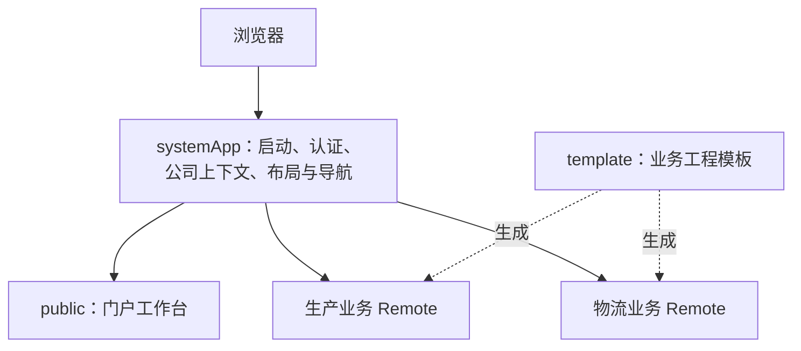

<!--
 * @Author: ChenYu ycyplus@gmail.com
 * @Date: 2026-10-03
 * @FilePath: \Robot_Admin\docs\module-federation-platform-plan.md
 * @Description: systemApp、public、template 三类工程的模块联邦演进计划
 * Copyright (c) 2026 by CHENY, All Rights Reserved.
-->

# 模块联邦平台演进计划

状态：方案已确认，架构拆分待实施。记录日期：2026-10-03。

本计划采用 `systemApp + public + template` 三类工程：平台集中提供通用能力，门户承接客户定制，业务项目由模板生成并接入平台。`systemApp` 同时承担主应用基座和通用系统管理，无须再拆一个独立的平台管理应用。当前产品没有低代码需求，本计划不包含低代码设计器、渲染器或相关应用分层。

当前单体模板继续作为功能基线和独立交付形态。本文只记录后续模块联邦版的目标与验收要求，不表示三个工程已经创建或接入完成。

## 一、三类工程的职责

| 工程                    | 职责                                                                                                                                                                     | 平台集成方式                                                           |
| ----------------------- | ------------------------------------------------------------------------------------------------------------------------------------------------------------------------ | ---------------------------------------------------------------------- |
| `systemApp` 平台基座    | 应用启动、登录与会话、主／兼任公司切换、权限、菜单、全局路由、布局与页签、主题与语言、请求认证、远程应用注册、错误处理和构建信息；用户、公司、角色、菜单、字典等通用管理 | 浏览器入口和平台能力的唯一所有者                                       |
| `public` 门户           | 客户工作台、应用入口、待办和消息聚合、业务概览、门户布局与个性化配置                                                                                                     | 作为门户 Remote 接入基座，按门户路由加载；客户差异由配置和定制模块承接 |
| `template` 业务项目模板 | 领域页面、领域 API、业务状态和业务组件的工程骨架；提供平台接入、独立调试、构建与测试约定                                                                                 | 用于生成生产、物流等业务应用；生成的业务应用作为各自的 Remote 接入基座 |

三类工程不等于部署时永远只有三个应用。`template` 是生成业务项目的模板来源，将来可生成多个业务应用；这不会增加框架种类。通用系统管理仍留在 `systemApp`，业务管理页面属于对应业务应用。

## 二、运行关系与所有权

1. 浏览器先启动 `systemApp`，完成认证、确认唯一主公司并取得权限。登录和平台启动所需资源由基座自身提供。
2. 平台进入门户路由时加载 `public`，进入某个业务路由时加载对应业务应用。登录首屏不加载门户或非必需业务 Remote。
3. `systemApp` 统一维护会话、全局路由、菜单、页签及公司上下文。门户和业务应用通过少量稳定、带类型的接口获取上下文、请求、导航、权限查询和主题／语言能力。
4. 门户和业务应用维护自己的页面与领域状态，不直接修改宿主 Store，不重复安装平台认证守卫、主题生命周期或全局布局。路由名称与页面缓存标识按应用命名，防止互相覆盖。
5. Remote 的页面资源与系统管理权限分别受对应授权约束。公共依赖共享不代表业务 Store、Router 或令牌可以任意共享所有权。

同一技术栈的新业务优先采用基座路由加载业务页面的接入方式。需要独立应用生命周期的场景再使用应用级 Bridge；采用 Bridge 时必须验证挂载、卸载、路由同步与缓存清理，不叠加未经约定的第二套全局路由或会话。

## 三、账号、公司与角色闭环

沿用当前 [企业认证契约](./enterprise-auth.md)：账号关联多个公司，登录自动进入唯一主公司，登录后可切换兼任公司；角色绑定账号在当前公司的成员关系。用户、公司与角色的通用管理归 `systemApp`。

公司切换由平台统一编排：服务端验证目标成员关系并轮换上下文令牌；成功后失效旧会话的请求、清理权限与动态路由、重置页签和页面缓存，再加载新公司的门户和业务数据。切换失败时保留原会话。缓存键须包含必要的租户、公司和用户维度，不能把跨公司缓存混用。

当前实现是前端 Mock 演示。真实账号认证、成员关系、公司内角色和数据范围须由后端确认。业务接口应从已验证的会话解析租户与公司，前端传入的公司 ID 不作为授权依据。模块联邦共享浏览器运行环境，本身不提供租户安全隔离。

## 四、门户定制与业务使用侧

`public` 采用同一份核心代码加客户配置、主题和少量定制模块。配置承接品牌、工作台布局、卡片、入口和展示开关；权限与数据范围仍来自平台和后端。真正不同的门户功能使用明确的扩展点，避免每个客户复制整个门户或长期维护一套分支。

`template` 应让业务开发者主要维护页面配置、领域 API 和业务逻辑。模板统一提供平台接入、独立开发入口、路由声明、权限标识、请求取消、页面缓存规则、环境检查、构建身份卡和测试骨架。独立调试采用同一平台契约的开发适配器，Mock 与正式配置保持明确区分。

现有 `@robot-admin/naive-ui-components`、`request-core`、`layout`、`theme`、`form-validate`、`directives` 和 `file-utils` 继续作为版本化公共依赖。`C_Form`、`C_Table` 等基础组件使用现有包入口，业务页面不额外依赖平台 Remote 来取得基础组件。联邦远程暴露重点放在门户和独立交付的业务能力。

平台接口先在集成层收敛；只有实际复用或独立发布需要明确后，才考虑发布 SDK 包。接口层和公共包都不属于新增的可部署应用。

## 五、工程、版本与部署约定

- 三类工程可使用 Bun Workspaces 统一开发，也可分仓维护；源码组织方式与独立部署是两个决定。初期优先集中管理契约、依赖和验证，确保业务应用仍可单独构建和发布。
- 建设初期对齐 Robot Admin 的技术栈与公共包基线，提交锁文件。Vue、Router、Pinia 和必要 UI 依赖的共享规则及兼容范围集中管理，不把 `singleton` 当作兼容性校验的替代品。
- 应用版本可按交付节奏独立演进；平台契约版本、兼容范围和关键共享依赖须接受构建与接入检查。当前 Vite、Router、联邦插件及 Bridge 组合以纵向样板测试结果确定。
- 远程应用名称、路由标识、发布路径、环境及兼容范围统一登记。地址来自当前环境的受控注册信息，避免端口散落、环境串线和任意远程地址加载。
- 每个部署应用生成独立的 [构建身份卡](./build-identity.md)，使用自己的应用 ID、版本、提交、环境和构建时间；平台可汇总已加载应用的信息。构建身份与运行时配置分开，公开文件不包含凭据。
- Remote Entry、Manifest 和构建身份卡采用适当的不缓存策略；内容哈希资源长期缓存。发布使用完整产物和可回滚的入口映射，保留仍被旧会话引用的资源，避免入口与 Chunk 版本混用。
- 非关键 Remote 失败时显示明确的模块错误和重试入口，平台导航与其他业务仍可使用；错误报告带应用、版本和请求标识，不返回静默空页面，也不无限重试。

## 六、实施顺序与阶段产出

以下阶段均为待实施，完成后再记录验证证据。

| 阶段                            | 工作内容                                                                 | 完成条件                                                           |
| ------------------------------- | ------------------------------------------------------------------------ | ------------------------------------------------------------------ |
| 1. 冻结功能基线与平台契约       | 保留当前单体；整理认证、公司上下文、请求、权限、路由、缓存和远程登记接口 | 职责有唯一所有者，契约可供门户与业务共同使用，无重复类型或配置来源 |
| 2. 建立 systemApp 与 public     | 平台基座包含通用管理；门户按客户配置独立组织并以 Remote 接入             | 平台自行启动；登录、门户、主／兼任公司切换和通用管理可完整演示     |
| 3. 建立 template 和一个业务样板 | 生成一个物流或生产业务工程，接入实际表单、列表和领域 API 适配            | 同一业务页面可独立调试并在平台中运行，使用现有组件包且接入配置精简 |
| 4. 补齐联邦运行与部署验收       | 加入故障、版本、缓存、权限、发布和回滚检查；量化性能                     | 必要回归与预算通过，独立发布及回滚不破坏其他应用                   |
| 5. 推广到项目集群               | 根据样板经验完善模板与接入文档，再扩展更多业务应用                       | 新业务按同一模板接入，不复制认证、平台布局或客户端定制分支         |

实施使用独立工作区和新架构分支，保留现有单体与架构分支。现有模块联邦分支中的集成代码按契约逐项复用，功能以已验证的单体基线为准；不通过整分支覆盖来替代差异核对。本文所属单体功能分支不因计划编写而执行架构迁移。

## 七、验收要求

### 功能与上下文

- 未登录访问、登录后主公司进入、无授权公司拒绝进入、兼任公司切换均有明确行为。
- 切换公司后，门户摘要、业务列表、菜单、按钮权限、页签和页面缓存与新上下文一致。
- 权限撤销、旧会话刷新、切换中的在途请求和重复操作不能使旧公司数据回写。
- 用户、公司、角色及成员关系的后端接入通过服务端授权和跨租户访问检查。

### 联邦与工程

- 门户和业务 Remote 的 404、超时、入口返回 HTML、版本不兼容及样式缺失均可定位，不导致整个基座白屏。
- 路由刷新、深链接、页签关闭与刷新、Remote 挂载卸载、主题和语言切换通过浏览器回归。
- 独立模式与集成模式使用同一业务实现；类型、Lint、契约、构建和必要浏览器测试通过。
- 正式产物不包含本地源码 alias、测试适配器、开发端口或其他环境的地址。
- 平台与子应用构建身份可核对，入口切换及回滚使用匹配的完整产物。

### 性能与使用成本

- 在相同设备、网络和缓存条件下对比单体基线，记录登录首屏资源、加载时间、首次业务进入和重复进入的结果，再确定预算。
- 登录首屏没有非必需 Remote 请求，业务按路由加载；共享依赖、网络缓存与样式加载由实际产物验证。
- 模板使用侧无需复制平台启动代码或手工维护多套会话、路由与主题状态。出现重复配置时，优先收敛接口而非增加工程数量。

## 八、记录来源

本计划基于对 `wl-ui-public`、`wl-ui-produce`、`lowcode-engine` 中 `systemApp` 相关源码和 Robot 架构分支的审阅，并按 Robot 当前没有低代码需求、门户需支持客户定制的目标收敛职责。参考的是职责与工程经验，不引入这些项目的业务代码或环境配置。

计划记录于 `feat/enterprise-experience-upgrade`。该分支于 2026-10-02 从 `dev` 创建，创建时提交为 `0a5d215`；此信息用于追溯计划来源，不代表未来实施分支已确定。
