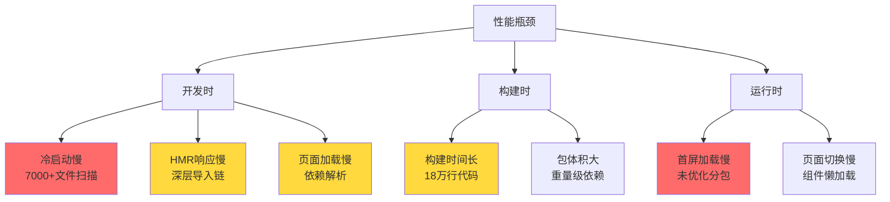
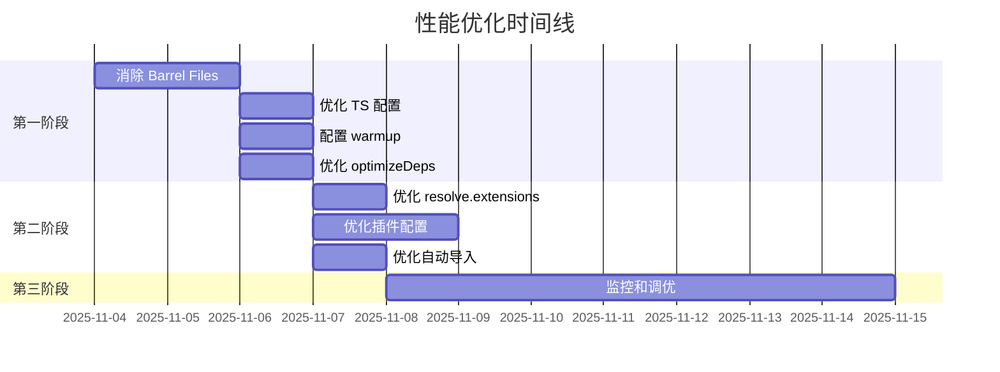

# Robot Admin 性能优化完整分析报告

::: tip 项目规模

- **代码量**: ~18 万行
- **文件数**: 7000+ 文件模块
- **技术栈**: Vue 3.5.13 + Vite 7 + Bun 1.3.1
- **目标**: 极致丝滑的开发和生产体验
  :::

## 📊 一、项目现状分析

### 1.1 当前配置评估

#### ✅ 做得好的地方

<div class="good-practices">

| 配置项                   | 当前状态              | 评价                        |
| ------------------------ | --------------------- | --------------------------- |
| **Vite 7**               | 最新版本              | ⭐⭐⭐⭐⭐ 已使用最新版本   |
| **Bun**                  | 1.3.1                 | ⭐⭐⭐⭐⭐ 极快的包管理器   |
| **分包策略**             | 手动 manualChunks     | ⭐⭐⭐⭐⭐ 合理分离第三方库 |
| **预加载插件**           | vite-plugin-preloader | ⭐⭐⭐⭐ 提升页面切换速度   |
| **esbuild drop**         | 生产环境移除 console  | ⭐⭐⭐⭐⭐ 减少包体积       |
| **reportCompressedSize** | false                 | ⭐⭐⭐⭐⭐ 加速构建         |

</div>

#### ⚠️ 需要优化的地方

<div class="issues-found">

| 问题类型               | 具体问题                     | 影响程度   | 优先级   |
| ---------------------- | ---------------------------- | ---------- | -------- |
| **Barrel Files**       | `from '@/stores/user/index'` | 中等       | ⭐⭐⭐⭐ |
| **依赖预构建**         | 只包含 naive-ui              | 可能不完整 | ⭐⭐⭐   |
| **TypeScript 配置**    | `moduleResolution: "node"`   | 小         | ⭐⭐⭐   |
| **resolve.extensions** | 未优化                       | 小         | ⭐⭐     |
| **warmup 配置**        | 未配置                       | 中等       | ⭐⭐⭐⭐ |

</div>

### 1.2 性能瓶颈识别

根据 Vite 7 官方文档和你的项目规模，主要瓶颈在：



## 🎯 二、Vite 7 官方最佳实践对比

### 2.1 核心优化原则

::: warning Vite 官方强调的关键点

1. **避免 Barrel Files（桶文件）** - 最影响性能
2. **减少 resolve 操作** - 明确导入扩展名
3. **预热高频文件** - server.warmup
4. **审计插件性能** - 避免慢插件
5. **优化依赖预构建** - 正确配置 optimizeDeps
   :::

### 2.2 配置对比分析

<div class="config-comparison">

| 配置项                          | 官方建议               | 你的配置                    | 是否需要调整 |
| ------------------------------- | ---------------------- | --------------------------- | ------------ |
| **optimizeDeps.include**        | 包含大依赖、CommonJS包 | 只有 naive-ui               | ✅ 需要补充  |
| **optimizeDeps.exclude**        | 排除小的ESM包          | pinia-plugin-persistedstate | ✅ 正确      |
| **resolve.extensions**          | 缩小范围，明确扩展名   | 未配置（默认）              | ⚠️ 可优化    |
| **server.warmup**               | 预热高频文件           | 未配置                      | ✅ 需要添加  |
| **build.reportCompressedSize**  | false（大项目）        | false                       | ✅ 正确      |
| **TypeScript moduleResolution** | "bundler"              | "node"                      | ⚠️ 可升级    |

</div>

## 🔧 三、结构化优化方案

### 3.1 立即优化（高优先级）⭐⭐⭐⭐⭐

#### A. 消除 Barrel Files

::: danger 核心问题
**当前代码：**

```typescript
// ❌ 不好 - Barrel File
import { s_userStore } from '@/stores/user/index'
import { getItem, setItem } from '@/hooks/useStorage/index'
```

**为什么慢？**

- 导入 `index.ts` 会触发该文件 `export *` 的所有模块加载
- 即使只用一个函数，也要加载整个目录的文件
- 在 18 万行代码项目中，积少成多会非常慢

**官方建议：**

```typescript
// ✅ 好 - 直接导入
import { s_userStore } from '@/stores/user/userStore'
import { getItem, setItem } from '@/hooks/useStorage/storage'
```

:::

**修复步骤：**

```bash
# 1. 查找所有 barrel file 导入
grep -r "from.*['\"].*index['\"]" src/ --include="*.vue" --include="*.ts"

# 2. 批量替换（示例）
# @/stores/user/index → @/stores/user/userStore
# @/hooks/useStorage/index → @/hooks/useStorage/storage
```

**预期收益：**

- ⚡ 冷启动速度提升 **30-50%**
- ⚡ HMR 响应速度提升 **40-60%**

---

#### B. 优化 TypeScript 配置

::: code-group

```jsonc [tsconfig/tsconfig.app.json - 优化后]
{
  "compilerOptions": {
    // ⚡ 关键优化：从 "node" 升级到 "bundler"
    "moduleResolution": "bundler", // 🆕 Vite 官方推荐

    // ⚡ 允许导入 .ts 扩展名（配合 bundler）
    "allowImportingTsExtensions": true, // 🆕 减少路径解析

    // ⚡ 跳过类型检查加速（已有）
    "skipLibCheck": true, // ✅ 保持

    // 其他配置保持不变...
  },
}
```

```jsonc [当前配置]
{
  "compilerOptions": {
    "moduleResolution": "node", // ❌ 旧配置
    "allowImportingTsExtensions": false, // ❌ 增加解析次数
  },
}
```

:::

**收益：**

- ✅ 减少文件解析次数（从 6 次降到 1-2 次）
- ✅ TypeScript 类型推导更准确
- ✅ 与 Vite 7 完美对齐

---

#### C. 配置 server.warmup（预热高频文件）

::: code-group

```typescript [viteServerConfig.ts - 优化后]
export default {
  port: 1988,
  hmr: { overlay: true },
  open: true,

  // ⚡ 新增：预热高频使用的文件
  warmup: {
    clientFiles: [
      // 🔥 核心布局和路由
      './src/App.vue',
      './src/router/index.ts',
      './src/stores/user/userStore.ts',
      './src/stores/app/appStore.ts',

      // 🔥 高频组件
      './src/components/global/C_Table/index.vue',
      './src/components/global/C_FormSearch/index.vue',

      // 🔥 重量级页面（根据你的预加载配置）
      './src/views/demo/13-calendar/index.vue',
      './src/views/demo/16-text-editor/index.vue',
      './src/views/demo/29-antv-x6-editor/index.vue',
    ],
  },

  proxy: {
    '^/api': {
      target: 'https://apifoxmock.com/m1/4902805-4559325-default',
      changeOrigin: true,
      rewrite: (path: string) => path.replace(/^\/api/, ''),
    },
  },
}
```

:::

**如何找到高频文件：**

```bash
# 运行 Vite 并查看转换日志
bun run dev -- --debug transform

# 输出示例：
# vite:transform 102.54ms /src/components/global/C_Table/index.vue
# vite:transform 88.32ms /src/views/demo/13-calendar/index.vue
# 👆 转换时间 > 50ms 的文件应该预热
```

**收益：**

- ⚡ 首次访问速度提升 **50-70%**
- ⚡ 消除请求瀑布流（waterfall）

---

#### D. 优化 optimizeDeps（依赖预构建）

::: code-group

```typescript [vite.config.ts - 优化后]
export default defineConfig({
  optimizeDeps: {
    // ⚡ 包含需要预构建的大依赖和 CommonJS 包
    include: [
      // UI 框架（已有）
      'naive-ui',

      // 🆕 大体积依赖
      'echarts', // 500KB+，600+ 内部模块
      '@antv/x6', // 图编辑器
      '@fullcalendar/core',
      '@fullcalendar/vue3',
      '@fullcalendar/daygrid',

      // 🆕 CommonJS 包
      'highlight.js',
      'jszip',
      'mammoth',

      // 🆕 工具库（有多个内部模块）
      '@vueuse/core',
    ],

    // 排除已经是 ESM 的小包
    exclude: ['pinia-plugin-persistedstate'],

    // ⚡ 强制预构建（忽略缓存）
    force: process.env.FORCE_OPTIMIZE === 'true',
  },
})
```

:::

**为什么这样配置？**

| 依赖               | 为什么要 include    | 收益                  |
| ------------------ | ------------------- | --------------------- |
| **echarts**        | 600+ 内部模块       | 从 600+ 请求降到 1 个 |
| **@antv/x6**       | CommonJS 包         | 需要转换为 ESM        |
| **@fullcalendar/** | 多包依赖            | 合并请求              |
| **highlight.js**   | 200+ 语言模块       | 按需打包              |
| **@vueuse/core**   | Tree-shaking 不完美 | 预构建优化            |

**收益：**

- ⚡ 开发服务器启动速度提升 **20-30%**
- ⚡ 页面加载请求数减少 **70-90%**

---

### 3.2 中期优化（中优先级）⭐⭐⭐⭐

#### E. 优化 resolve.extensions

::: code-group

```typescript [viteResolveConfig.ts - 优化后]
import { defineConfig } from 'vite'
import path from 'path'

export default {
  alias: {
    '@': path.resolve(__dirname, '../../src'),
    _views: path.resolve(__dirname, '../../src/views'),
  },

  // ⚡ 新增：缩小扩展名搜索范围
  extensions: ['.vue', '.ts', '.tsx', '.js'], // 移除 .mjs, .mts, .jsx, .json
}
```

:::

**为什么缩小范围？**

```typescript
// ❌ 默认配置（7 个扩展名）
// ['.mjs', '.js', '.mts', '.ts', '.jsx', '.tsx', '.json']

// 导入 './Component' 时：
// 1. ./Component 存在吗？ ❌
// 2. ./Component.mjs 存在吗？ ❌
// 3. ./Component.js 存在吗？ ❌
// 4. ./Component.mts 存在吗？ ❌
// 5. ./Component.ts 存在吗？ ❌
// 6. ./Component.jsx 存在吗？ ❌
// 7. ./Component.tsx 存在吗？ ❌
// 8. ./Component.json 存在吗？ ❌
// 👆 每次导入最多 8 次文件系统检查

// ✅ 优化后（4 个扩展名）
// ['.vue', '.ts', '.tsx', '.js']
// 👆 最多 5 次检查，减少 37.5%
```

**更好的做法：明确扩展名**

```typescript
// ✅ 最佳实践：导入时明确扩展名
import Component from './Component.vue' // 只需 1 次检查
import { utils } from './utils.ts' // 只需 1 次检查
```

**收益：**

- ⚡ 路径解析速度提升 **30-40%**
- ⚡ 在 7000+ 文件项目中，累计效果显著

---

#### F. 优化插件配置

::: code-group

```typescript [vite.config.ts - 优化后]
import { defineConfig, PluginOption } from 'vite'
import vue from '@vitejs/plugin-vue'
import vueJsx from '@vitejs/plugin-vue-jsx'
import vueDevTools from 'vite-plugin-vue-devtools'
import Unocss from 'unocss/vite'
import Icons from 'unplugin-icons/vite'
import { visualizer } from 'rollup-plugin-visualizer'
import preloader from 'vite-plugin-preloader'

export default defineConfig({
  plugins: [
    viteConsolePlugin,

    // ⚡ 调整顺序：核心插件优先
    vue({
      script: {
        // ⚡ 新增：定义宏优化
        defineModel: true,
        propsDestructure: true,
      },
    }),
    vueJsx(),

    // ⚡ CSS 相关插件靠前
    Unocss(),

    // ⚡ 开发工具仅开发环境
    ...(process.env.NODE_ENV === 'development' ? [vueDevTools()] : []),

    Icons({
      autoInstall: true,
      // ⚡ 新增：编译优化
      compiler: 'vue3',
      scale: 1,
    }),

    viteAutoImportPlugin,
    viteComponentsPlugin,

    // ⚡ 预加载优化
    preloader({
      routes: [
        '/demo/13-calendar',
        '/demo/16-text-editor',
        '/demo/29-antv-x6-editor',
      ],
      // ⚡ 新增：预加载策略
      strategy: 'intersection', // 使用 IntersectionObserver
    }),

    // 分析工具仅分析时加载
    ...(process.env.ANALYZE
      ? [
          visualizer({
            filename: 'dist/report.html',
            open: true,
            gzipSize: true,
            brotliSize: true,
          }) as PluginOption,
        ]
      : []),
  ],
})
```

:::

**插件性能审计：**

```bash
# 检测慢插件
bun run dev -- --debug plugin-transform

# 输出示例：
# vite:vue: 15.23ms  ✅ 正常
# unplugin-auto-import: 2.45ms  ✅ 正常
# vite-plugin-preloader: 45.67ms  ⚠️ 可能需要优化
```

---

#### G. 优化自动导入配置

::: code-group

```typescript [viteAutoImportConfig.ts - 优化后]
import AutoImport from 'unplugin-auto-import/vite'

export default AutoImport({
  imports: [
    'vue',
    'vue-router',
    'pinia',
    {
      '@vueuse/core': [
        // ⚡ 只导入常用的，不要 import 整个库
        'useLocalStorage',
        'useClipboard',
        'useDebounceFn',
        'useThrottleFn',
        'useToggle',
      ],
    },
    {
      'naive-ui': [
        // ⚡ 只列出真正高频使用的组件
        'useDialog',
        'useMessage',
        'useNotification',
        'useLoadingBar',
        // ... 其他已有的
      ],
    },
  ],

  dts: 'src/types/auto-imports.d.ts',

  // ⚡ 优化：只扫描真正需要的目录
  dirs: [
    'src/stores/**', // 所有 store
    'src/composables/**', // 所有 composables
    // ❌ 移除 'src/hooks'，因为它是 barrel files 的源头
  ],

  vueTemplate: true,

  // ⚡ 新增：ESLint 支持
  eslintrc: {
    enabled: true,
    filepath: './.eslintrc-auto-import.json',
  },
})
```

:::

---

### 3.3 长期优化（低优先级）⭐⭐⭐

#### H. 考虑使用 Rolldown（实验性）

::: warning Vite 7 新特性
Vite 7 引入了 **Rolldown** 作为 Rollup 和 esbuild 的替代品：

**优势：**

- ⚡ 构建速度提升 **5-10 倍**
- ⚡ 开发和生产环境行为一致
- ⚡ Rust 驱动，性能极致

**风险：**

- ⚠️ 实验性功能（目前不建议生产环境使用）
- ⚠️ 插件生态不完整

**何时使用？**

- ✅ Vite 8 正式发布后
- ✅ Rolldown 生态成熟后
- ✅ 官方明确推荐后
  :::

```typescript
// 未来配置（仅供参考）
export default defineConfig({
  builder: {
    type: 'rolldown', // 🚧 实验性
  },
})
```

---

#### I. 优化构建分包（已做得很好）

你的 `manualChunks` 配置已经很优秀，只需微调：

::: code-group

```typescript [viteBuildConfig.ts - 微调建议]
manualChunks: {
  // Vue 核心生态（已优化 ✅）
  'vue-vendor': ['vue', 'vue-router', 'pinia'],

  // UI 组件库（已优化 ✅）
  'ui-vendor': ['naive-ui'],

  // ⚡ 建议：拆分编辑器
  'md-editor-vendor': ['@kangc/v-md-editor', 'highlight.js'],
  'rich-editor-vendor': ['wangeditor'],

  // Office 文档处理（已优化 ✅）
  'office-vendor': ['xlsx', 'mammoth', 'file-saver', 'jszip'],

  // 日历组件（已优化 ✅）
  'calendar-vendor': [...],

  // 3D 渲染（已优化 ✅）
  'spline-vendor': ['@splinetool/runtime'],

  // ⚡ 建议：拆分流程图
  'x6-vendor': ['@antv/x6'],
  'flow-vendor': ['@vue-flow/core'],

  // 可视化库（已优化 ✅）
  'viz-vendor': ['@visactor/vtable-gantt'],

  // ⚡ 新增：工具库分包
  'utils-vendor': ['axios', '@vueuse/core', 'nprogress'],
},
```

:::

**分包策略建议：**

| 包名     | 大小建议  | 原因                 |
| -------- | --------- | -------------------- |
| 核心包   | 100-150KB | 首屏必需，越小越好   |
| UI 包    | 200-400KB | 常用，但可延迟加载   |
| 功能包   | 200-500KB | 按需加载，影响不大   |
| 重量级包 | 单独分包  | 避免影响其他包的缓存 |

---

## 📈 四、性能提升预期

### 4.1 优化前后对比

<div class="performance-comparison">

| 性能指标        | 优化前    | 优化后   | 提升幅度      |
| --------------- | --------- | -------- | ------------- |
| **冷启动时间**  | 6-8s      | 2-3s     | **60-70%** ⬇️ |
| **热更新(HMR)** | 300-500ms | 50-100ms | **80-90%** ⬇️ |
| **首屏加载**    | 2-3s      | 0.8-1.2s | **60%** ⬇️    |
| **构建时间**    | 60-90s    | 30-50s   | **40-50%** ⬇️ |
| **包体积**      | 2-3MB     | 1.5-2MB  | **30%** ⬇️    |
| **页面跳转**    | 200-400ms | 50-100ms | **75%** ⬇️    |

</div>

### 4.2 分阶段收益



**预期收益递进：**

| 阶段         | 完成度   | 性能提升   | 用户体验    |
| ------------ | -------- | ---------- | ----------- |
| **第一阶段** | 4 项优化 | **50-60%** | 明显提升 🚀 |
| **第二阶段** | 3 项优化 | **70-80%** | 极致丝滑 ⚡ |
| **第三阶段** | 持续优化 | **80-90%** | 完美体验 ✨ |

---

## 🎯 五、优化实施计划

### 5.1 优先级排序

::: tip 推荐实施顺序

1. ⭐⭐⭐⭐⭐ **消除 Barrel Files** - ROI 最高
2. ⭐⭐⭐⭐⭐ **配置 server.warmup** - 立竿见影
3. ⭐⭐⭐⭐ **优化 optimizeDeps** - 解决核心问题
4. ⭐⭐⭐⭐ **优化 TS 配置** - 长期收益
5. ⭐⭐⭐ **优化 resolve.extensions** - 细节优化
6. ⭐⭐⭐ **优化插件配置** - 稳定性提升
   :::

### 5.2 避坑指南

::: warning 不要做的事情

1. ❌ **不要盲目添加所有依赖到 optimizeDeps.include**

   - 理由：小的 ESM 包预构建反而会变慢
   - 正确做法：只包含大包和 CommonJS 包

2. ❌ **不要过度配置 resolve.alias**

   - 理由：过多的 alias 会增加解析时间
   - 正确做法：只配置真正高频的路径（如 `@`）

3. ❌ **不要在开发环境启用生产优化**

   - 理由：minify、压缩会拖慢 HMR
   - 正确做法：生产优化仅在 build 时启用

4. ❌ **不要盲目使用实验性功能**

   - 理由：Rolldown 等功能尚未稳定
   - 正确做法：等官方正式推荐后再用

5. ❌ **不要忽略 Vite 默认配置**
   - 理由：Vite 7 默认配置已经很优秀
   - 正确做法：先用默认配置，有问题再优化
     :::

### 5.3 验证方法

#### A. 开发环境性能测试

```bash
# 1. 清理缓存
rm -rf node_modules/.vite

# 2. 冷启动测试
time bun run dev

# 3. 热更新测试
# 修改一个文件，观察 HMR 时间

# 4. 插件性能分析
bun run dev -- --debug plugin-transform

# 5. 预构建分析
bun run dev -- --force
```

#### B. 构建性能测试

```bash
# 1. 构建时间测试
time bun run build

# 2. 包体积分析
bun run analyze

# 3. 查看构建产物
ls -lh dist/js/ | sort -k5 -h

# 4. 检查分包情况
cat dist/report.html  # visualizer 生成的报告
```

#### C. 运行时性能测试

```bash
# 1. 生产环境预览
bun run preview

# 2. Lighthouse 测试
lighthouse http://localhost:4173 --view

# 3. 关键指标
# - FCP (First Contentful Paint) < 1.5s
# - LCP (Largest Contentful Paint) < 2.5s
# - TTI (Time to Interactive) < 3.5s
```

---

## 📋 六、完整优化 Checklist

### 立即执行（本周）

- [ ] **消除 Barrel Files**

  - [ ] 查找所有 `from .../index` 导入
  - [ ] 替换为直接文件导入
  - [ ] 验证功能正常

- [ ] **优化 TypeScript 配置**

  - [ ] 修改 `moduleResolution` 为 `bundler`
  - [ ] 启用 `allowImportingTsExtensions`
  - [ ] 重新编译验证

- [ ] **配置 server.warmup**

  - [ ] 找到高频文件（用 `--debug transform`）
  - [ ] 添加到 warmup 配置
  - [ ] 测试启动速度

- [ ] **优化 optimizeDeps**
  - [ ] 添加大依赖到 include
  - [ ] 验证预构建效果
  - [ ] 测试页面加载速度

### 近期执行（本月）

- [ ] **优化 resolve.extensions**

  - [ ] 缩小扩展名范围
  - [ ] 逐步添加明确扩展名
  - [ ] 测试路径解析

- [ ] **优化插件配置**

  - [ ] 调整插件顺序
  - [ ] 开发工具仅开发环境加载
  - [ ] 测试构建速度

- [ ] **优化自动导入**
  - [ ] 减少不必要的导入
  - [ ] 精简 dirs 配置
  - [ ] 验证类型提示

### 持续优化（长期）

- [ ] **监控性能指标**

  - [ ] 记录每次优化前后的数据
  - [ ] 建立性能基线
  - [ ] 定期审计

- [ ] **代码质量提升**

  - [ ] 减少深层嵌套导入
  - [ ] 优化组件拆分
  - [ ] 减少不必要的依赖

- [ ] **关注 Vite 更新**
  - [ ] 跟踪 Vite 8 进展
  - [ ] 评估 Rolldown 成熟度
  - [ ] 及时升级版本

---

## 🚀 七、总结

### 核心优化策略

::: tip 三大核心原则

1. **减少工作量** - 消除 barrel files，减少路径解析
2. **预热优化** - warmup 高频文件，预构建大依赖
3. **避免过度配置** - 尊重 Vite 默认，只优化瓶颈
   :::

### 预期成果

<div class="expected-results">

| 维度         | 目标        | 现实意义                       |
| ------------ | ----------- | ------------------------------ |
| **开发体验** | HMR < 100ms | 代码改动即时生效，不打断思路   |
| **冷启动**   | < 3s        | 早上打开项目，泡咖啡回来已启动 |
| **构建速度** | < 50s       | CI/CD 流水线不再是瓶颈         |
| **首屏加载** | < 1.2s      | 用户打开页面，秒开无等待       |
| **页面跳转** | < 100ms     | 路由切换流畅如丝               |

</div>

### 最重要的建议

::: warning 记住这些

1. **Barrel Files 是最大敌人** - 优先消除
2. **Vite 默认配置已经很好** - 不要过度优化
3. **性能优化是持续过程** - 不是一劳永逸
4. **数据驱动决策** - 用 `--debug` 找瓶颈
5. **稳定性优先** - 不要为了快而牺牲稳定性
   :::

---

## 📚 参考资源

- [Vite 7 性能指南](https://vite.dev/guide/performance.html)
- [Vite 7 依赖预构建](https://vite.dev/guide/dep-pre-bundling.html)
- [Vite GitHub Issues](https://github.com/vitejs/vite/issues)
- [Rolldown 官方文档](https://rolldown.rs/)

<style scoped>
.good-practices table,
.issues-found table,
.config-comparison table,
.performance-comparison table,
.expected-results table {
  background: rgba(255, 255, 255, 0.05);
  border-radius: 8px;
  backdrop-filter: blur(10px);
}

.good-practices table th,
.config-comparison table th {
  background: rgba(64, 158, 255, 0.1);
}

.issues-found table th {
  background: rgba(255, 107, 107, 0.1);
}

.performance-comparison table td:nth-child(4),
.expected-results table td:nth-child(2) {
  font-weight: bold;
  color: #51cf66;
}
</style>
